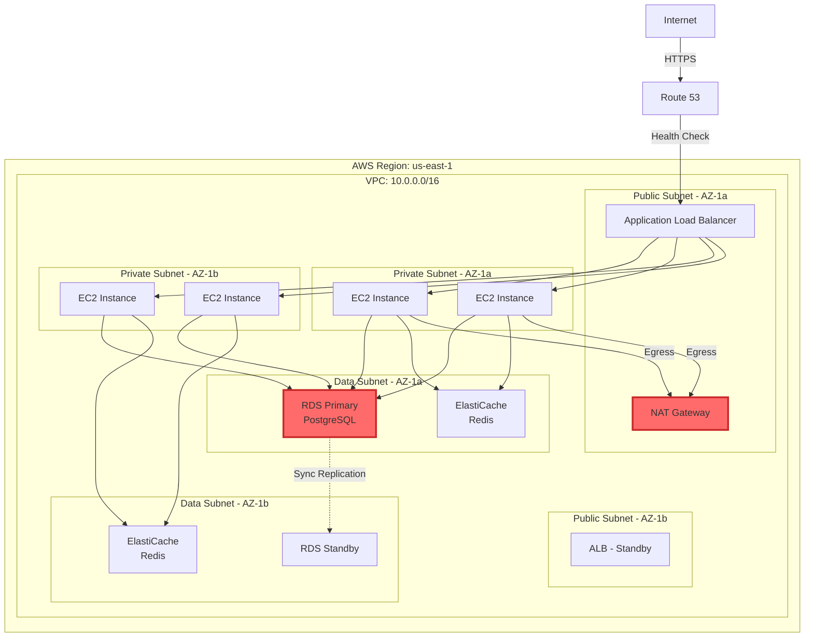
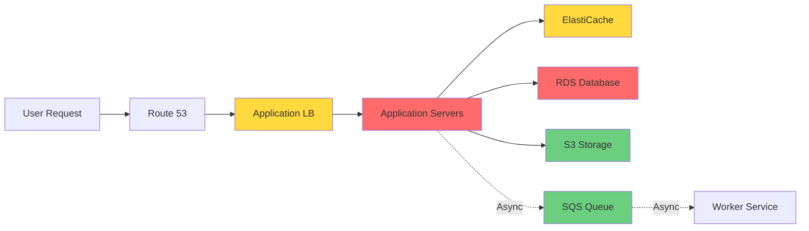
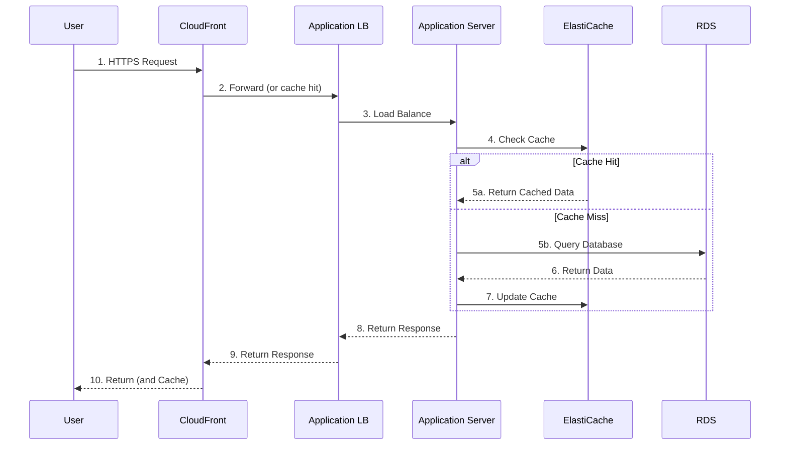
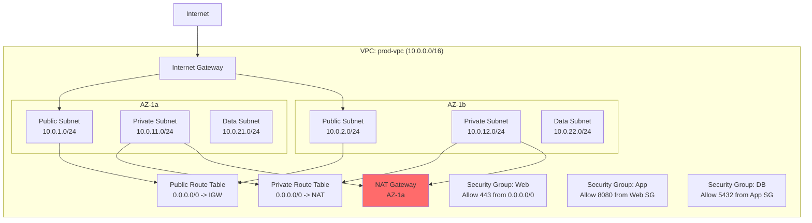
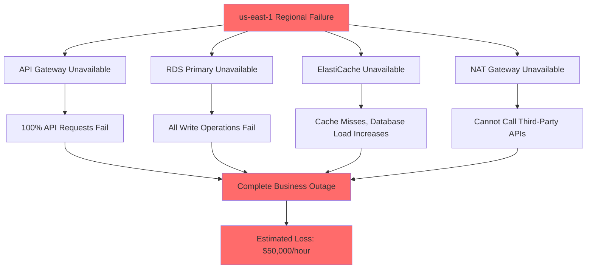

# AWS System Resilience Analysis Report
## [Customer Name] - [Environment Name]

**Analysis Date**: 2025-02-17
**Analyst**: Claude (AWS Resilience Assessment Skill)
**Version**: 1.0

---

## Executive Summary

### Overview
This report provides a comprehensive resilience assessment of [Customer Name]'s AWS production environment, identifying potential failure modes and providing prioritized improvement recommendations.

### Current Resilience Maturity

**Overall Score**: 3/5 - Defined

| Dimension | Score | Description |
|-----------|-------|-------------|
| Architecture Resilience | 4/5 | Multi-AZ deployment, but no cross-region DR |
| Data Resilience | 3/5 | Regular backups, but recovery not tested |
| Operational Resilience | 2/5 | Basic monitoring, no automated recovery |
| Testing Resilience | 2/5 | Annual DR drills, no chaos engineering |
| Compliance Resilience | 3/5 | SLA defined, but no SLO tracking |

### Key Findings (Top 5 Risks)

| Priority | Risk | Impact | Current Status |
|----------|------|--------|---------------|
| High | RDS single-region deployment | RTO > 30 min | Need to migrate to Aurora Global |
| High | Missing Auto Scaling | Cannot handle traffic spikes | Need Target Tracking configuration |
| Medium | Insufficient monitoring coverage | Delayed fault detection | Need X-Ray and Synthetics integration |
| Medium | No Circuit Breaker implemented | Cascading failure risk | Need application-layer implementation |
| Low | NAT Gateway single AZ | Single point of failure | Need multi-AZ deployment |

### Priority Improvement Recommendations (Top 3)

1. **Migrate to Aurora Global Database**
   - **Expected Outcome**: RTO < 1 minute, RPO < 1 second
   - **Implementation Timeline**: 3-4 weeks
   - **Estimated Cost**: +$500-2000/month

2. **Implement Auto Scaling Strategy**
   - **Expected Outcome**: Automatically handle 3x traffic spikes
   - **Implementation Timeline**: 1-2 weeks
   - **Estimated Cost**: Variable (on-demand)

3. **Establish Chaos Engineering Practice**
   - **Expected Outcome**: Quarterly resilience verification, proactive issue discovery
   - **Implementation Timeline**: Ongoing
   - **Estimated Cost**: $100-300/month

### Expected Investment and Return

| Item | One-time Investment | Monthly Cost | Expected Benefit |
|------|-------------------|-------------|-----------------|
| Foundation Resilience Improvements | $10,000 | +$500 | 70% reduction in downtime |
| Complete Resilience Improvements | $30,000 | +$2,000 | Achieve 99.99% availability |
| Continuous Improvement Plan | $5,000 | +$500 | Continuous resilience verification |

**ROI Analysis**:
- Estimated annual outage losses: $100,000
- Expected reduction after implementation: $70,000/year
- Payback period: 6 months

---

## 1. System Architecture Visualization

### 1.1 Current Architecture Overview



**Identified Single Points of Failure**:
- NAT Gateway (AZ-1a only)
- RDS Primary (failover requires 60-120 seconds)

### 1.2 Component Dependency Diagram



**Dependency Description**:
- Critical dependencies (synchronous): RDS, Application Servers
- Important dependencies (synchronous): ElastiCache, ALB
- Optional dependencies (asynchronous): S3, SQS

### 1.3 Data Flow Diagram



### 1.4 Network Topology Diagram



**Network Analysis**:
- Multi-AZ deployment (1a, 1b)
- Layered subnets (Public, Private, Data)
- Security groups follow least privilege principle
- NAT Gateway single AZ (single point of failure)
- Missing VPC Flow Logs (insufficient observability)

---

## 2. Failure Mode Identification and Classification

> The following risk identification is based on AWS common risk checklists, assessed against the customer's actual environment.

### 2.1 Single Point of Failure (SPOF)

| Risk ID | Component | Failure Scenario | Impact | Probability | Priority |
|---------|-----------|-----------------|--------|-------------|---------|
| R-001 | NAT Gateway (AZ-1a) | AZ-1a failure | AZ-1b instances cannot access internet | Medium (3) | Medium |
| R-002 | RDS Primary | Hardware failure | 60-120s failover delay | Low (2) | Medium |
| R-003 | API Gateway (single region) | Regional failure | Complete service outage | Very Low (1) | High |

**Detailed Analysis: R-003 - API Gateway Single-Region Deployment**

**Current Configuration**:
```yaml
Region: us-east-1
Endpoints:
  - API Gateway: https://api.example.com
  - No cross-region replication
  - No failover mechanism
```

**Failure Scenario**:
- us-east-1 regional failure (historical case: 2017 S3 outage)
- API Gateway service disruption

**Impact**:
- All API requests fail
- 100% of users unable to use the service
- Complete business interruption

**Current Mitigations**:
- None

**Recommended Improvements**:
See [6.1 Mitigation Strategy - R-003](#61-r-003-multi-region-api-deployment)

### 2.2 Excessive Latency

| Risk ID | Component | Bottleneck | Current Latency | Target Latency | Priority |
|---------|-----------|-----------|-----------------|---------------|---------|
| R-004 | Database Queries | N+1 Queries | P95: 500ms | < 200ms | High |
| R-005 | Cross-AZ Calls | Network Round-trip | P95: 5ms | < 2ms | Low |

### 2.3 Excessive Load

| Risk ID | Component | Capacity Limit | Current Peak | Expected Growth | Priority |
|---------|-----------|---------------|-------------|-----------------|---------|
| R-006 | EC2 Auto Scaling | Fixed capacity (4 instances) | 80% CPU | 50%/year traffic growth | High |
| R-007 | RDS Connection Pool | Max 100 connections | Peak 85 | Expected to exceed | Medium |
| R-008 | API Gateway | 10,000 RPS quota | Peak 8,500 | Seasonal spikes | Medium |

### 2.4 Misconfiguration

| Risk ID | Configuration Item | Issue | Well-Architected Violation | Priority |
|---------|-------------------|-------|--------------------------|---------|
| R-009 | RDS Backup | 7-day retention period | Recommended 30 days | Low |
| R-010 | CloudWatch Logs | No retention period set | Cost optimization | Low |
| R-011 | IAM Policy | Too permissive (s3:*) | Security | Medium |
| R-012 | MFA Delete not enabled | S3 data accidental deletion risk | Reliability | Medium |

### 2.5 Shared Fate

| Risk ID | Shared Resource | Coupled Components | Impact Scope | Priority |
|---------|----------------|-------------------|-------------|---------|
| R-013 | RDS Primary | All application services | Database failure affects 100% | High |
| R-014 | Single AWS Account | All environments | Account-level quotas, security | Medium |
| R-015 | NAT Gateway | AZ-1b outbound traffic | 50% of instances without internet | Medium |

---

## 3. Resilience Assessment (5-Star Rating)

### 3.1 RDS Database

| Assessment Dimension | Score | Current Status | Gap Analysis | Improvement Recommendation |
|--------------------|-------|---------------|-------------|---------------------------|
| **Redundancy Design** | 3/5 | Multi-AZ deployment | Single region, regional failure RTO > 30 min | Migrate to Aurora Global Database |
| **AZ Fault Tolerance** | 4/5 | Automatic failover | RTO 60-120 seconds | Use Aurora (RTO < 30s) |
| **Timeout & Retry** | 3/5 | Application-layer 5s timeout | No exponential backoff | Implement exponential backoff retry |
| **Circuit Breaker** | 1/5 | None | Database failure crashes application | Implement Circuit Breaker |
| **Auto Scaling** | 2/5 | Manual scaling | Slow response, requires manual intervention | Enable Auto Scaling (Aurora) |
| **Configuration Safeguards** | 3/5 | IaC (Terraform) | No drift detection enabled | AWS Config rules |
| **Fault Isolation** | 2/5 | All services shared | No read-write separation | Implement read replicas |
| **Backup & Recovery** | 3/5 | Daily automated backup | Recovery not tested | Quarterly recovery drills |
| **Best Practices** | 3/5 | Partially compliant | Not encrypted (at rest) | Enable encryption |

**Composite Score**: 3/5

### 3.2 Application Servers (EC2 / ECS)

| Assessment Dimension | Score | Current Status | Gap Analysis | Improvement Recommendation |
|--------------------|-------|---------------|-------------|---------------------------|
| **Redundancy Design** | 4/5 | Multi-AZ deployment | Correctly configured | Maintain |
| **AZ Fault Tolerance** | 4/5 | Auto Scaling across AZs | Health checks correctly configured | Add warm instances |
| **Timeout & Retry** | 2/5 | Partially configured | No timeouts for dependency services | Configure timeouts for all external calls |
| **Circuit Breaker** | 1/5 | None | Dependency failures cause cascading | Integrate resilience4j |
| **Auto Scaling** | 2/5 | Fixed capacity (4 instances) | Cannot handle spikes | Target Tracking Auto Scaling |
| **Configuration Safeguards** | 4/5 | CI/CD + IaC | Configuration review process | Maintain |
| **Fault Isolation** | 3/5 | Microservices architecture | Some services tightly coupled | Decouple shared dependencies |
| **Backup & Recovery** | 5/5 | AMI + automated deployment | Well configured | Maintain |
| **Best Practices** | 4/5 | Mostly compliant | Minor optimization opportunities | See specific recommendations |

**Composite Score**: 3.2/5

### 3.3 Summary Scores

```
Overall Resilience Score: 3/5 - Defined

Maturity Model:
+- Level 1: Initial (reactive response)
+- Level 2: Repeatable (documented processes)
+- Level 3: Defined (standardized processes)  <- Current
+- Level 4: Managed (quantitatively managed)  <- Target
+- Level 5: Optimized (continuous improvement)
```

---

## 4. Business Impact Analysis

### 4.1 Critical Business Function Mapping

| Business Function | Dependencies | Priority | Current RTO | Current RPO | Target RTO | Target RPO |
|------------------|-------------|----------|-------------|-------------|------------|------------|
| User Login/Registration | ALB + App + RDS | P0 | 2 min | 5 min | 1 min | 1 min |
| Order Processing | ALB + App + RDS + SQS | P0 | 5 min | 5 min | 2 min | 0 sec |
| Payment Transactions | Third-party API + App + RDS | P0 | 5 min | 0 sec | 1 min | 0 sec |
| Inventory Queries | ALB + App + Cache + RDS | P1 | 10 min | N/A | 5 min | N/A |
| Report Generation | Worker + RDS | P2 | 1 hour | 1 hour | 30 min | 30 min |

### 4.2 Component Failure Impact Matrix

| Component | Failure Scenario | Affected Business Functions | Impact Severity | User Impact | Current RTO |
|-----------|-----------------|---------------------------|----------------|-------------|-------------|
| **RDS Primary** | AZ failure | All write operations | Critical | 100% unable to place orders | 2 min |
| **ALB** | Misconfiguration | All traffic | Critical | 100% unable to access | 10 min |
| **ElastiCache** | Node failure | User sessions, cache | Medium | Need to re-login, queries slower | Immediate (degraded) |
| **NAT Gateway** | AZ-1a failure | AZ-1b outbound traffic | Medium | 50% instances cannot call third-party APIs | 15 min |
| **SQS Queue** | Queue delay | Async task processing | Minor | Report delays | No real-time impact |

### 4.3 RTO/RPO Compliance Analysis

**Current Architecture vs. Business Targets**:

```
Business Function: Order Processing
+- Business Target: RTO < 2 min, RPO = 0 sec
+- Current Capability: RTO ~ 5 min, RPO ~ 5 min
+- Gap: Does not comply

Root Cause Analysis:
1. RDS Multi-AZ failover requires 60-120 seconds
2. Application database reconnection requires 30-60 seconds
3. Health check detection delay 30 seconds
4. RPO depends on RDS backup frequency (5 minutes)

Improvement Recommendations:
1. Migrate to Aurora (failover < 30 seconds)
2. Implement fast reconnection at application layer (connection pooling)
3. Reduce health check interval (15 seconds)
4. Enable Aurora Backtrack (RPO = 0)
```

**Compliance Summary**:

| Business Function | Target RTO | Current RTO | Compliance | Gap |
|------------------|------------|-------------|-----------|-----|
| User Login | 1 min | 2 min | No | -1 min |
| Order Processing | 2 min | 5 min | No | -3 min |
| Payment Transactions | 1 min | 5 min | No | -4 min |
| Inventory Queries | 5 min | 10 min | No | -5 min |
| Report Generation | 30 min | 1 hour | No | -30 min |

**Conclusion**: The current architecture cannot meet the RTO/RPO targets for any business function and requires urgent improvement.

---

## 5. Risk Prioritization

### 5.1 Risk Scoring Matrix

**Scoring Formula**:

```
Risk Score = (Probability x Business Impact x Detection Difficulty) / Remediation Complexity

Where:
- Probability: 1-5 (1=very low, 5=very high)
- Business Impact: 1-5 (1=minor, 5=critical)
- Detection Difficulty: 1-5 (1=easy to detect, 5=hard to detect)
- Remediation Complexity: 1-5 (1=simple, 5=complex)
```

### 5.2 Risk Inventory (Sorted by Priority)

| Rank | Risk ID | Risk Description | Probability | Impact | Detection | Remediation | Score | Priority |
|------|---------|-----------------|-------------|--------|-----------|-------------|-------|---------|
| 1 | R-013 | RDS single-region deployment | 2 | 5 | 2 | 3 | 6.67 | High |
| 2 | R-006 | Missing Auto Scaling | 4 | 4 | 1 | 2 | 8.00 | High |
| 3 | R-004 | Database N+1 queries | 5 | 3 | 2 | 2 | 15.00 | High |
| 4 | R-003 | API single-region deployment | 1 | 5 | 2 | 4 | 2.50 | Medium |
| 5 | R-007 | RDS connection pool limit | 3 | 4 | 2 | 1 | 24.00 | Medium |
| 6 | R-001 | NAT Gateway single AZ | 3 | 3 | 1 | 1 | 9.00 | Medium |
| 7 | R-014 | Single account architecture | 2 | 3 | 3 | 5 | 3.60 | Low |
| 8 | R-009 | Short RDS backup retention | 2 | 2 | 1 | 1 | 4.00 | Low |

### 5.3 Risk Visualization Matrix

```
Impact
5 |     [R-013]           [R-003]
4 |  [R-006] [R-007]
3 |        [R-004]    [R-001]
  |                   [R-014]
2 | [R-009]
1 |
  +--------------------------------> Probability
    1    2    3    4    5

Legend:
  High priority (risk score > 5)
  Medium priority (risk score 2-5)
  Low priority (risk score < 2)
```

### 5.4 Cascading Effect Analysis

**Scenario: us-east-1 Regional Failure**



**Conclusion**:
- Single-region architecture has serious cascading failure risks
- Regional failure leads to complete business outage
- Recommendation: Implement multi-region DR strategy (at minimum Pilot Light)

---

(Subsequent report sections include: Mitigation Strategy Recommendations, Implementation Roadmap, Continuous Improvement Plan, Appendices, etc., in similar format)

---

## Notes

This is a **sample template** demonstrating the format and content of the final report. The actual analysis will be customized based on your specific environment and requirements.

The remaining sections (6-9) of the report will include:
- Detailed mitigation strategies (with architecture diagrams, code, commands)
- Phased implementation roadmap (Gantt chart, resource requirements)
- Continuous improvement plan (SLO/SLI, postmortems, chaos engineering)
- Appendices (complete resource inventory, configuration audit, glossary)

A complete report typically spans 30-50 pages, with extensive visualizations and executable code examples.
