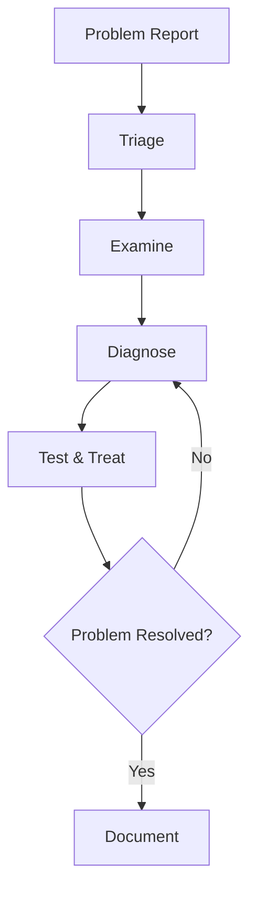

> Part of the [AWS Resilience Analysis Framework Reference](resilience-framework.md).

## 2. AWS Resilience Analysis Core Principles

### 2.1 Error Budget

**Core Philosophy**:
> "Reject the pursuit of 100% reliability. Balance unavailability risk with innovation speed and operational efficiency."

**Calculation Formula**:

```
Error Budget = (1 - SLO) x Time Period

Example:
SLO = 99.9% (monthly)
Error Budget = (1 - 0.999) x 30 days x 24 hours x 60 minutes
             = 0.001 x 43,200 minutes
             = 43.2 minutes/month
```

**Error Budget Policy**:

| Error Budget Status | Remaining | Action |
|--------------------|-----------|--------|
| Healthy | > 50% | Accelerate feature releases, conduct chaos experiments |
| Warning | 20-50% | Slow release cadence, increase testing |
| Exhausted | < 20% | Freeze feature releases, focus on reliability |
| Overspent | < 0% | Complete freeze, postmortem, mandatory reliability improvements |

**Strategic Advantages**:
- Aligns product development (velocity) and SRE (reliability) incentives
- Depoliticizes release decisions through objective measurement
- Teams self-regulate when budget is exhausted
- Legitimizes risk-taking within budget

### 2.2 SLI/SLO/SLA

**Definitions**:

```yaml
SLI (Service Level Indicator):
  Definition: Quantitative measurement of service performance
  Format: Successful events / Total events (0-100%)
  Examples:
    - Percentage of requests with latency < 100ms
    - Percentage of requests returning HTTP 200
    - Availability (uptime percentage)

SLO (Service Level Objective):
  Definition: Target reliability level
  Examples:
    - 99.9% of requests complete within 100ms
    - 99.99% of requests return success (non-5xx)
  Purpose: Internal goal setting, error budget calculation

SLA (Service Level Agreement):
  Definition: Contractual agreement with customers
  Examples:
    - Monthly availability 99.9%, otherwise 10% refund
  Characteristics:
    - Financial consequences for violations
    - Typically lower than SLO (leave buffer)
    - Legal contract, commit cautiously
```

**Relationship**:

```
SLA (External Promise)  99.9%  <- Customer contract
                         |
                         | Buffer (avoid breach)
                         v
SLO (Internal Target)  99.95% <- Internal engineering target
                         |
                         | Error budget
                         v
SLI (Actual Measurement) 99.97% <- Real-time monitoring
```

**SLI Selection Guide**:

| Service Type | Recommended SLI | Not Recommended SLI |
|-------------|-----------------|---------------------|
| **Request-driven** | Availability, latency, throughput | CPU, memory (internal metrics) |
| **Storage** | Durability, availability, latency | Disk utilization |
| **Batch** | Throughput, end-to-end latency | Task queue length |
| **Stream Processing** | Freshness, correctness | Kafka lag (intermediate metric) |

### 2.3 Four Golden Signals

| Signal | Description | Measurement | Alarm Threshold |
|--------|-------------|-------------|-----------------|
| **Latency** | Request response time | P50, P95, P99 latency | P95 > 2x baseline |
| **Traffic** | System demand | Requests/second, sessions | Spike > 3x baseline |
| **Errors** | Failed request rate | 5xx errors / total requests | > 1% |
| **Saturation** | Resource utilization | CPU, memory, disk, network | > 80% |

**Important Distinctions**:
- **Successful request latency vs. failed request latency**: Failures are usually faster (fail fast), but may also timeout
- **Explicit errors vs. implicit errors vs. policy errors**:
  - Explicit: HTTP 500
  - Implicit: HTTP 200 but wrong content
  - Policy: Throttling (HTTP 429)

### 2.4 Monitoring Methods

**White-Box Monitoring vs. Black-Box Monitoring**:

| Characteristic | White-Box | Black-Box |
|---------------|-----------|-----------|
| **Data Source** | Internal metrics, logs, profiling | External probes, user simulation |
| **Detection Timing** | Early (predict failures) | Active failures |
| **Coverage** | Comprehensive (including hidden issues) | User-visible issues |
| **Alert Frequency** | High (early warning) | Low (actual impact) |
| **Example** | CPU approaching saturation | Health check failure |

**Recommended Strategy**:
- Extensive white-box monitoring (prediction and diagnosis)
- Critical black-box monitoring (user impact verification)
- White-box detection -> Black-box verification

**Implementation**:
```yaml
White-Box Monitoring:
  CloudWatch:
    - CPU, memory, disk, network
    - Application metrics (custom)
    - Log analysis

  X-Ray:
    - Distributed tracing
    - Service dependency map

  Container Insights:
    - ECS/EKS container metrics

Black-Box Monitoring:
  Route 53 Health Checks:
    - HTTPS endpoint checks
    - Multi-region probes
    - String matching

  CloudWatch Synthetics:
    - Canary scripts (user journeys)
    - Periodic execution
    - Screenshots and HAR files

  Third-party:
    - Pingdom
    - Datadog Synthetics
```

### 2.5 Effective Alerting Philosophy

**Effective Alert Criteria**:
1. Detects an undiscovered urgent actionable condition
2. Indicates actual user impact
3. Requires intelligent response (not mechanical fix)
4. Addresses a new problem

**Principles**:
- Alerts should be rare enough to maintain urgency
- Frequent alerts cause fatigue and missed critical alerts
- "If an alert fires weekly, it shouldn't be an alert -- it should be automated remediation or a ticket"

**Alert Tiers**:

| Priority | Description | Response SLA | Impact | Example |
|----------|-------------|-------------|--------|---------|
| **P0 (Critical)** | Affects all users | Immediate (15 min) | Complete outage | Database unavailable |
| **P1 (High)** | Affects some users | 1 hour | Degraded service | Single AZ failure |
| **P2 (Medium)** | Affects internal or early warning | Same day | Potential issue | Disk space < 30% |
| **P3 (Low)** | Informational | Normal business hours | No direct impact | Certificate expires in 30 days |

**Alert Fatigue Prevention**:
```yaml
Strategies:
  Alert Aggregation:
    - Merge multiple related alerts into one
    - Avoid "alert storms"

  Multi-Window Alerts:
    - Short window (5 min) + long window (30 min)
    - Avoid transient flapping

  Alert Suppression:
    - Auto-suppress during maintenance windows
    - Dependencies (database failure suppresses app alerts)

  Progressive Escalation:
    - 5 minutes: Slack notification
    - 15 minutes: Pager alert
    - 30 minutes: Escalate to senior SRE
```

### 2.6 Postmortem Culture

**Core Principle: Blameless**

```yaml
Blameless Principles:
  - Focus on identifying contributing factors
  - Do not blame individuals or teams
  - Derived from high-risk industries like healthcare and aviation
  - Assume everyone had good intentions

Philosophy:
  "Human error is a symptom, not a cause"

  Root causes are typically:
  - System design flaws
  - Process deficiencies
  - Missing tools
  - Insufficient training
```

**Postmortem Template**:

```markdown
# Incident Postmortem: [Title]

## Metadata
- Date: 2025-02-17
- Severity: P1 (High)
- Duration: 45 minutes
- Impact: 30% of users unable to log in
- Author: [Name]
- Reviewer: [Name]

## Executive Summary
(2-3 sentences summarizing what happened, impact, root cause, fix)

## Timeline
| Time | Event | Action |
|------|-------|--------|
| 10:00 | Login failure rate increase detected | Auto-alert triggered |
| 10:05 | On-call engineer receives alert | Begins investigation |
| 10:15 | Identified as RDS connection pool exhaustion | Decision to increase pool |
| 10:30 | Increased pool size to 1000 | Config change executed |
| 10:45 | Service fully recovered | Incident closed |

## Root Cause
RDS connections reached maximum (500), application unable to create new connections.
Contributing factors:
1. Traffic spike (3x normal)
2. Application code connection leak
3. Insufficient connection pool monitoring

## Impact
- User impact: 30% (approx. 1000 users)
- SLO impact: Violated 99.9% SLO, consumed 15 minutes of error budget
- Business impact: Estimated $5000 revenue loss

## Detection
What went well:
- CloudWatch alert worked as expected (5 min detection)
- On-call responded promptly

Needs improvement:
- Connection leak not detected proactively
- Connection pool utilization not monitored

## Response
What went well:
- Root cause identified within 15 minutes
- Transparent communication (status page updated)
- Rollback plan executed smoothly

Needs improvement:
- Initial diagnosis went in wrong direction (wasted 5 min)
- Incomplete runbook

## Recovery
- Recovery time: 45 minutes (target: 30 minutes)
- Recovery method: Increased connection pool + application restart
- User impact continued until full recovery

## Action Items
| Priority | Action | Owner | Due Date | Status |
|----------|--------|-------|----------|--------|
| P0 | Add connection pool utilization alert | @SRE-team | 2025-02-20 | Done |
| P0 | Fix application connection leak | @Dev-team | 2025-02-24 | In progress |
| P1 | Update runbook (connection pool failure) | @SRE-team | 2025-02-27 | To do |
| P2 | Conduct load testing | @QA-team | 2025-03-01 | To do |
| P2 | Implement Circuit Breaker | @Dev-team | 2025-03-15 | To do |

## Lessons Learned
1. Connection pools are stateful resources requiring dedicated monitoring
2. Traffic spikes need Auto Scaling + resource quota reservations
3. Applications must gracefully handle resource exhaustion (fail fast)
4. Runbooks must be reviewed and updated regularly

## Supporting Data
(Attach charts, log fragments, metric screenshots)
```

**Best Practices**:

```yaml
Collaboration:
  - Real-time collaboration tools (Wiki, document collaboration platforms)
  - Comment system (everyone can add insights)
  - Cross-team participation (development, operations, product)

Review:
  "An unreviewed postmortem is wasted effort"
  - At least 2 reviewers (technical + management)
  - Verify action items are actionable
  - Ensure blameless principles

Visibility:
  - Celebrate good practices (acknowledge transparency and honesty)
  - Leadership participation (show importance)
  - Public sharing (internal knowledge base)
  - Monthly postmortem sharing sessions

Feedback:
  - Regularly survey process effectiveness
  - Track action item completion rate
  - Measure similar incident recurrence rate
```

**Culture Promotion Activities**:

```yaml
Monthly Postmortem Sharing:
  - Select the most educational postmortem
  - Company-wide lunch sharing
  - Q&A session

Book Club:
  - Discuss historical events (aviation accidents, medical incidents)
  - Apply to technical systems
  - Identify systemic issues

Wheel of Misfortune:
  - Simulate real incident scenarios
  - Rotate on-call roles
  - Practice incident response processes
  - Identify runbook gaps
```

### 2.7 Effective Troubleshooting

**Methodology: Hypothetico-Deductive Method**

**Key Phases**:



**1. Problem Report**

```yaml
Required Information:
  - Expected behavior: What should happen?
  - Actual behavior: What actually happened?
  - Reproduction method: How to reproduce the issue?
  - Impact scope: How many users are affected?
  - Start time: When did it start?

Sources:
  - User reports
  - Monitoring alerts
  - Health check failures
```

**2. Triage**

```yaml
Primary Duty: "Land the plane safely"

Priority Order:
  1. Stop the bleeding
     - Switch to backup systems
     - Rate-limit to protect core services
     - Roll back erroneous changes

  2. Restore service
     - Even without knowing root cause
     - Temporary solutions are OK

  3. Root cause analysis
     - Dig deep after service is restored
     - Detailed investigation in postmortem

Quick Decisions:
  - 5 minutes to decide whether to roll back
  - 15 minutes to decide whether to escalate
```

**3. Examine**

```yaml
Collect Data:
  Time Series Metrics:
    - CloudWatch Metrics
    - Compare before and after failure
    - Identify anomalous patterns

  Logs:
    - CloudWatch Logs Insights
    - Error logs, application logs
    - Correlate by request ID

  Traces:
    - X-Ray Traces
    - Identify slow services
    - Find failure points

  Current State:
    - Health check endpoints
    - AWS Service Health Dashboard
    - Resource utilization

Tools:
  - CloudWatch Dashboards
  - X-Ray Service Map
  - CloudTrail (change audit)
  - AWS Config (configuration changes)
```

**4. Diagnose**

**Strategies**:

| Strategy | Description | When to Use |
|----------|-------------|-------------|
| **Simplify and Reduce** | Incrementally remove components to identify the problem | Complex systems |
| **Bisection** | Split the system in half, determine which half has the problem | Long processes |
| **Ask "What", "Where", "Why"** | Systematic questioning | Root cause analysis |
| **Check Recent Changes** | 80% of failures stem from changes | First check |

**Example: Bisection Method**

```
User Request -> API Gateway -> Lambda -> DynamoDB -> Response
                ^                ^          ^
                |                |          |
           Slow here?       Slow here?    Slow here?

Test 1: Call Lambda directly (bypass API Gateway)
Result: Still slow -> Problem not in API Gateway

Test 2: Lambda directly queries DynamoDB
Result: Fast -> Problem is in Lambda business logic

Test 3: Analyze each part of Lambda code
Result: Found N+1 query problem
```

**5. Test and Treat**

```yaml
Hypothesis-Driven:
  1. Form hypothesis
     Example: "RDS connection pool exhaustion causing timeouts"

  2. Design test
     - Check RDS connection count metrics
     - Review application connection pool configuration
     - Check for connection leaks

  3. Execute test
     - Collect data
     - Analyze results

  4. Validate or refute
     - Hypothesis correct -> Implement fix
     - Hypothesis incorrect -> New hypothesis

Document:
  - Record each hypothesis
  - Record test methods
  - Record results
  - Record reasoning process
```

**Common Pitfalls**:

```yaml
Focusing on Irrelevant Symptoms:
  Bad: "CPU is high, so it's slow"
  Good: "What's causing the slowness? Is high CPU the result or cause?"

Over-Relying on Past Causes:
  Bad: "Last time it was the database, must be the same"
  Good: "Let data guide, not assumptions"

Chasing False Correlations:
  Bad: "Problem appeared after deployment, must be the deployment"
  Good: "Temporal correlation != causation, need evidence"

Ignoring Simple Explanations:
  Bad: Complex theories (network partition, cosmic rays)
  Good: Occam's Razor: The simplest explanation is usually correct
```

---

