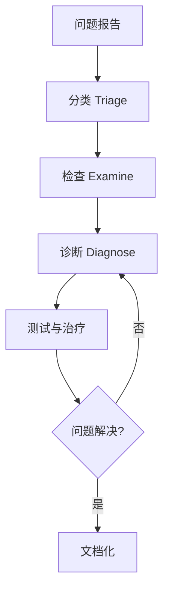

> 属于 [AWS 韧性分析框架参考](resilience-framework_zh.md) 的一部分。

## 2. AWS 韧性分析核心原则

### 2.1 错误预算 (Error Budget)

**核心哲学**：
> "拒绝追求 100% 可靠性。平衡不可用风险与创新速度和运营效率"

**计算公式**：

```
Error Budget = (1 - SLO) × 时间周期

示例：
SLO = 99.9%（月度）
Error Budget = (1 - 0.999) × 30 天 × 24 小时 × 60 分钟
             = 0.001 × 43,200 分钟
             = 43.2 分钟/月
```

**错误预算政策**：

| 错误预算状态 | 剩余 | 行动 |
|------------|------|------|
| 🟢 健康 | > 50% | 加速功能发布，进行混沌实验 |
| 🟡 警告 | 20-50% | 减缓发布节奏，增加测试 |
| 🔴 耗尽 | < 20% | 冻结功能发布，专注可靠性 |
| ⛔ 超支 | < 0% | 完全冻结，事后复盘，强制可靠性改进 |

**战略优势**：
- 协调产品开发（速度）和 SRE（可靠性）激励
- 通过客观测量消除发布决策政治化
- 预算耗尽时团队自我管控
- 在预算内合法化冒险

### 2.2 SLI/SLO/SLA

**定义**：

```yaml
SLI (Service Level Indicator):
  定义: 服务性能的定量测量
  格式: 成功事件数 / 总事件数 (0-100%)
  示例:
    - 延迟 < 100ms 的请求百分比
    - HTTP 200 响应的请求百分比
    - 可用性（正常运行时间百分比）

SLO (Service Level Objective):
  定义: 目标可靠性水平
  示例:
    - 99.9% 的请求在 100ms 内完成
    - 99.99% 的请求返回成功（非 5xx）
  用途: 内部目标设定，错误预算计算

SLA (Service Level Agreement):
  定义: 与客户的合同协议
  示例:
    - 月度可用性 99.9%，否则退款 10%
  特点:
    - 违反有财务后果
    - 通常低于 SLO（留有缓冲）
    - 法律合同，需谨慎承诺
```

**关系**：

```
SLA (对外承诺)    99.9%  ◄─ 客户合同
                   │
                   │ 缓冲（避免违约）
                   ▼
SLO (内部目标)    99.95% ◄─ 内部工程目标
                   │
                   │ 错误预算
                   ▼
SLI (实际测量)    99.97% ◄─ 实时监控
```

**SLI 选择指南**：

| 服务类型 | 推荐 SLI | 不推荐 SLI |
|---------|---------|-----------|
| **请求驱动** | 可用性、延迟、吞吐量 | CPU、内存（内部指标）|
| **存储** | 持久性、可用性、延迟 | 磁盘利用率 |
| **批处理** | 吞吐量、端到端延迟 | 任务队列长度 |
| **流处理** | 新鲜度、正确性 | Kafka lag（中间指标）|

### 2.3 四大黄金信号

| 信号 | 描述 | 测量方式 | 告警阈值 |
|------|------|---------|---------|
| **延迟 (Latency)** | 请求响应时间 | P50, P95, P99 延迟 | P95 > 2x 基线 |
| **流量 (Traffic)** | 系统需求 | 请求/秒、会话数 | 突增 > 3x 基线 |
| **错误 (Errors)** | 失败请求率 | 5xx 错误 / 总请求 | > 1% |
| **饱和度 (Saturation)** | 资源利用率 | CPU、内存、磁盘、网络 | > 80% |

**重要区分**：
- **成功请求延迟 vs 失败请求延迟**：失败通常更快（快速失败），但也可能超时
- **显式错误 vs 隐式错误 vs 策略性错误**：
  - 显式：HTTP 500
  - 隐式：HTTP 200 但内容错误
  - 策略性：限流（HTTP 429）

### 2.4 监控方法

**白盒监控 vs 黑盒监控**：

| 特性 | 白盒监控 | 黑盒监控 |
|------|---------|---------|
| **数据源** | 内部指标、日志、性能分析 | 外部探针、用户模拟 |
| **检测时机** | 早期（预测故障） | 活跃故障时 |
| **覆盖范围** | 全面（包括隐藏问题） | 用户可见问题 |
| **告警频率** | 高（预警） | 低（实际影响） |
| **示例** | CPU 接近饱和 | 健康检查失败 |

**推荐策略**：
- 大量白盒监控（预测和诊断）
- 关键黑盒监控（用户影响验证）
- 白盒检测 → 黑盒验证

**实施**：
```yaml
白盒监控:
  CloudWatch:
    - CPU、内存、磁盘、网络
    - 应用指标（自定义）
    - 日志分析

  X-Ray:
    - 分布式追踪
    - 服务依赖图

  Container Insights:
    - ECS/EKS 容器指标

黑盒监控:
  Route 53 Health Checks:
    - HTTPS 端点检查
    - 多区域探针
    - 字符串匹配

  CloudWatch Synthetics:
    - Canary 脚本（用户旅程）
    - 定期执行
    - 截图和HAR文件

  第三方:
    - Pingdom
    - Datadog Synthetics
```

### 2.5 有效告警哲学

**有效告警标准**：
1. 检测到未被发现的紧急可操作条件
2. 表示实际用户影响
3. 需要智能响应（非机械修复）
4. 解决新问题

**原则**：
- 告警应足够稀有以维持紧迫性
- 频繁告警导致疲劳和错过关键告警
- "如果告警每周触发，就不应该是告警，应该是自动化修复或ticket"

**告警层级**：

| 优先级 | 描述 | 响应 SLA | 影响 | 示例 |
|--------|------|---------|------|------|
| **P0 (Critical)** | 影响所有用户 | 立即（15 分钟） | 完全中断 | 数据库不可用 |
| **P1 (High)** | 影响部分用户 | 1 小时 | 降级服务 | 单 AZ 故障 |
| **P2 (Medium)** | 影响内部或预警 | 当天 | 潜在问题 | 磁盘空间 < 30% |
| **P3 (Low)** | 信息性 | 正常工作时间 | 无直接影响 | 证书 30 天后过期 |

**告警疲劳避免**：
```yaml
策略:
  告警聚合:
    - 多个相关告警合并为一个
    - 避免"告警风暴"

  多窗口告警:
    - 短窗口（5 分钟）+ 长窗口（30 分钟）
    - 避免瞬时抖动

  告警抑制:
    - 维护窗口自动抑制
    - 依赖关系（数据库故障抑制应用告警）

  渐进升级:
    - 5 分钟：Slack 通知
    - 15 分钟：寻呼机告警
    - 30 分钟：升级到高级 SRE
```

### 2.6 事后复盘文化 (Postmortem Culture)

**核心原则：无责任文化 (Blameless)**

```yaml
无责任原则:
  - 专注于识别促成因素
  - 不指责个人或团队
  - 源自医疗和航空等高风险行业
  - 假设每个人都怀有良好意图

理念:
  "Human error is a symptom, not a cause"
  （人为错误是症状，而非原因）

  根本原因通常是：
  - 系统设计缺陷
  - 流程不足
  - 工具缺失
  - 培训不够
```

**事后复盘模板**：

```markdown
# 事故复盘：[标题]

## 元数据
- 日期：2025-02-17
- 严重程度：P1（高）
- 持续时间：45 分钟
- 影响：30% 用户无法登录
- 作者：[Name]
- 审查人：[Name]

## 执行摘要
（2-3 句话概述发生了什么、影响、根因、修复）

## 时间线
| 时间 | 事件 | 行动 |
|------|------|------|
| 10:00 | 检测到登录失败率上升 | 自动告警触发 |
| 10:05 | On-call 工程师收到告警 | 开始调查 |
| 10:15 | 识别为 RDS 连接池耗尽 | 决策增加连接池 |
| 10:30 | 增加连接池大小到 1000 | 执行配置变更 |
| 10:45 | 服务完全恢复 | 关闭事故 |

## 根本原因
RDS 连接数达到最大值（500），应用无法创建新连接。
促成因素：
1. 流量突增（比平时高 3 倍）
2. 应用代码存在连接泄漏
3. 连接池监控不足

## 影响
- 用户影响：30%（约 1000 用户）
- SLO 影响：违反 99.9% SLO，消耗 15 分钟错误预算
- 业务影响：估计损失 $5000 收入

## 检测
✅ 做得好：
- CloudWatch 告警按预期工作（5 分钟检测）
- On-call 及时响应

❌ 需改进：
- 未提前检测到连接泄漏
- 未监控连接池利用率

## 响应
✅ 做得好：
- 15 分钟内识别根因
- 沟通透明（状态页更新）
- 回滚计划执行顺利

❌ 需改进：
- 初期诊断方向错误（浪费 5 分钟）
- Runbook 不完整

## 恢复
- 恢复时间：45 分钟（目标：30 分钟）
- 恢复方法：增加连接池 + 重启应用
- 用户影响持续到完全恢复

## 行动项
| 优先级 | 行动 | 负责人 | 截止日期 | 状态 |
|--------|------|--------|---------|------|
| P0 | 添加连接池利用率告警 | @SRE-team | 2025-02-20 | ✅ 完成 |
| P0 | 修复应用连接泄漏 | @Dev-team | 2025-02-24 | 🔄 进行中 |
| P1 | 更新 Runbook（连接池故障） | @SRE-team | 2025-02-27 | ⏳ 待办 |
| P2 | 进行负载测试 | @QA-team | 2025-03-01 | ⏳ 待办 |
| P2 | 实施 Circuit Breaker | @Dev-team | 2025-03-15 | ⏳ 待办 |

## 经验教训
1. 连接池是有状态资源，需要特别监控
2. 流量突增需要 Auto Scaling + 资源配额预留
3. 应用必须优雅处理资源耗尽（快速失败）
4. Runbook 必须定期审查和更新

## 支持数据
（附加图表、日志片段、指标截图）
```

**最佳实践**：

```yaml
协作:
  - 实时协作工具（Wiki、文档协作平台）
  - 评论系统（所有人可以添加见解）
  - 跨团队参与（开发、运维、产品）

审查:
  "未经审查的事后复盘形同虚设"
  - 至少 2 名审查人（技术 + 管理）
  - 验证行动项的可操作性
  - 确保无责任原则

可见化:
  - 庆祝良好实践（表彰透明和诚实）
  - 领导层参与（显示重视）
  - 公开分享（内部知识库）
  - 月度复盘分享会

反馈:
  - 定期调查流程有效性
  - 跟踪行动项完成率
  - 测量类似事故重复率
```

**文化推广活动**：

```yaml
月度复盘分享:
  - 选择最有学习价值的复盘
  - 全公司午餐分享
  - Q&A 环节

读书俱乐部:
  - 讨论历史事件（航空事故、医疗事故）
  - 应用到技术系统
  - 识别系统性问题

灾难角色扮演 (Wheel of Misfortune):
  - 模拟真实事故场景
  - 轮换 On-call 角色
  - 练习事故响应流程
  - 识别 Runbook 差距
```

### 2.7 有效故障排查

**方法论：假设-演绎法**

**关键阶段**：



**1. 问题报告**

```yaml
必需信息:
  - 期望行为：应该发生什么？
  - 实际行为：实际发生了什么？
  - 复现方法：如何重现问题？
  - 影响范围：有多少用户受影响？
  - 开始时间：何时开始的？

来源:
  - 用户报告
  - 监控告警
  - 健康检查失败
```

**2. 分类 (Triage)**

```yaml
首要职责: "让飞机安全着陆"

优先级排序:
  1. 止血（停止出血）
     - 切换到备用系统
     - 限流保护核心服务
     - 回滚错误变更

  2. 恢复服务
     - 即使不知道根因
     - 临时解决方案 OK

  3. 根因分析
     - 服务恢复后再深入
     - 事后复盘详细调查

快速决策:
  - 5 分钟决定是否回滚
  - 15 分钟决定是否升级
```

**3. 检查 (Examine)**

```yaml
收集数据:
  时间序列指标:
    - CloudWatch Metrics
    - 对比故障前后
    - 识别异常模式

  日志:
    - CloudWatch Logs Insights
    - 错误日志、应用日志
    - 关联请求 ID

  追踪:
    - X-Ray Traces
    - 识别慢服务
    - 找到故障点

  当前状态:
    - 健康检查端点
    - AWS 服务健康仪表板
    - 资源利用率

工具:
  - CloudWatch Dashboards
  - X-Ray Service Map
  - CloudTrail（变更审计）
  - AWS Config（配置变更）
```

**4. 诊断 (Diagnose)**

**策略**：

| 策略 | 描述 | 何时使用 |
|------|------|---------|
| **简化和化简** | 逐步移除组件，识别问题所在 | 复杂系统 |
| **二分法** | 将系统分两半，确定问题在哪一半 | 长流程 |
| **追问"什么""哪里""为什么"** | 系统性询问 | 根因分析 |
| **查看最近变更** | 80% 故障源于变更 | 首要检查 |

**示例：二分法**

```
用户请求 → API Gateway → Lambda → DynamoDB → 返回
            ^                ^          ^
            |                |          |
       慢在这里?        慢在这里?    慢在这里?

测试 1: 直接调用 Lambda（绕过 API Gateway）
结果：仍然慢 → 问题不在 API Gateway

测试 2: Lambda 直接查询 DynamoDB
结果：快速 → 问题在 Lambda 业务逻辑

测试 3: 分析 Lambda 代码各部分
结果：发现 N+1 查询问题
```

**5. 测试与治疗**

```yaml
假设驱动:
  1. 形成假设
     示例："RDS 连接池耗尽导致超时"

  2. 设计测试
     - 检查 RDS 连接数指标
     - 查看应用连接池配置
     - 检查是否有连接泄漏

  3. 执行测试
     - 收集数据
     - 分析结果

  4. 验证或反驳
     - 假设正确 → 实施修复
     - 假设错误 → 新假设

文档化:
  - 记录每个假设
  - 记录测试方法
  - 记录结果
  - 记录推理过程
```

**常见陷阱**：

```yaml
关注无关症状:
  ❌ "CPU 高，所以慢"
  ✅ "慢的原因是什么？CPU 高是结果还是原因？"

过度依赖过去问题原因:
  ❌ "上次是数据库，这次肯定也是"
  ✅ "让数据引导，而非假设"

追逐虚假相关性:
  ❌ "部署后出问题，肯定是部署的问题"
  ✅ "时间相关性 ≠ 因果关系，需要证据"

忽视简单解释:
  ❌ 复杂的理论（网络分区、宇宙射线）
  ✅ 奥卡姆剃刀：最简单的解释通常是正确的
```

---

