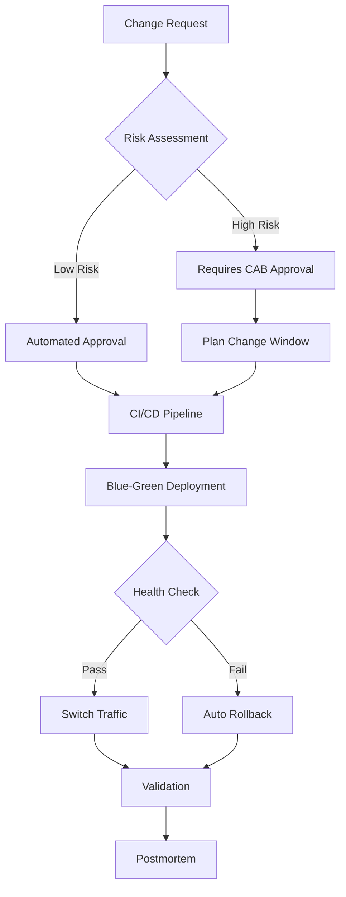
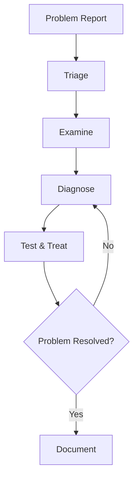

# AWS Resilience Analysis Framework - Detailed Reference

This document is based on the latest 2025 knowledge in system resilience, integrating best practices from the AWS Well-Architected Framework, AWS Resilience Analysis Framework, and Chaos Engineering.

## Table of Contents

- [1. AWS Well-Architected Framework - Reliability Pillar (2025)](#1-aws-well-architected-framework---reliability-pillar-2025)
- [2. AWS Resilience Analysis Core Principles](#2-aws-resilience-analysis-core-principles)
- [3. Chaos Engineering Methodology](#3-chaos-engineering-methodology)
- [4. Modern Observability Standards](#4-modern-observability-standards)
- [5. Cloud Design Patterns (Resilience-Related)](#5-cloud-design-patterns-resilience-related)
- [Summary](#summary)

---

## 1. AWS Well-Architected Framework - Reliability Pillar (2025)

### 1.1 Five Design Principles

#### Principle 1: Automatically Recover from Failure

**Core Concept**:
- Achieve automated failure detection and recovery by monitoring Key Performance Indicators (KPIs)
- KPIs should measure business value, not technical details
- Enable automated notification, tracking, and recovery workflows
- Use predictive automation to proactively fix failures

**Implementation Points**:
```yaml
Monitoring Strategy:
  Business Metrics:
    - Order completion rate
    - User login success rate
    - Transaction processing time

  Technical Metrics:
    - CPU/memory utilization
    - Network throughput
    - Error rate

Auto Recovery:
  - Auto Scaling Groups (automatic replacement of failed instances)
  - RDS Multi-AZ (automatic failover)
  - Route 53 Health Checks (DNS failover)
  - Lambda Dead Letter Queues (failure retry)
```

#### Principle 2: Test Recovery Procedures

**Core Concept**:
- Proactively validate recovery strategies in cloud environments
- Use automation to simulate various failure scenarios
- Reproduce historical failure scenarios
- Discover and fix problem paths before real failures occur

**Implementation Tools**:
- AWS Fault Injection Simulator (FIS)
- GameDays / Disaster Recovery Drills

**Test Frequency**:
- Chaos experiments: Weekly (Staging)
- DR failover drills: Monthly (partial traffic)
- Full DR drills: Quarterly (Production)
- Tabletop exercises: Monthly (theoretical scenarios)

#### Principle 3: Scale Horizontally

**Core Concept**:
- Replace single large resources with multiple smaller resources
- Reduce single point of failure impact
- Distribute requests across multiple smaller resources
- Avoid shared single points of failure

**Architecture Patterns**:
```
Anti-pattern (Vertical Scaling):
+-----------------+
| Single Large    |  <- Single point of failure
| EC2 (m5.24xl)  |
+-----------------+

Best Practice (Horizontal Scaling):
+------+ +------+ +------+ +------+
| EC2  | | EC2  | | EC2  | | EC2  |  <- Redundancy and fault tolerance
|(m5.xl)|(m5.xl)|(m5.xl)|(m5.xl)|
+------+ +------+ +------+ +------+
```

#### Principle 4: Stop Guessing Capacity

**Core Concept**:
- Automatically adjust resources based on monitoring
- Monitor demand and utilization
- Automatically add or remove resources
- Maintain optimal utilization
- Manage service quotas and constraints

**AWS Services**:
- AWS Auto Scaling (EC2, ECS, DynamoDB)
- Application Auto Scaling
- Predictive Scaling (ML-based prediction)
- Service Quotas (quota management)

#### Principle 5: Manage Change Through Automation

**Core Concept**:
- All infrastructure changes through automation
- Use Infrastructure as Code (IaC)
- Traceable and reviewable change processes
- Reduce human errors

**Implementation Tools**:
```yaml
IaC Tools:
  - AWS CloudFormation
  - Terraform
  - AWS CDK (TypeScript/Python)
  - Pulumi

CI/CD Tools:
  - AWS CodePipeline
  - GitHub Actions
  - GitLab CI
  - Jenkins

GitOps:
  - ArgoCD
  - Flux CD
```

### 1.2 Disaster Recovery Strategies

AWS provides four primary disaster recovery strategies, in order of increasing cost and complexity:

| Strategy | RTO | RPO | Cost | Complexity | Use Case |
|----------|-----|-----|------|-----------|---------|
| **Backup & Restore** | Hours-Days | Hours-Days | $ | Low | Data loss or corruption scenarios |
| **Pilot Light** | 10 min-Hours | Minutes | $$ | Medium | Regional disasters |
| **Warm Standby** | Minutes | Seconds-Minutes | $$$ | Medium-High | Critical business systems |
| **Multi-Site Active-Active** | Seconds-Minutes | Seconds | $$$$ | High | Mission-critical systems |

#### Strategy 1: Backup and Restore

**Architecture**:
```
+--------------------------------------------------+
| Primary Region (us-east-1)                        |
|  +----------+      Periodic Backup +------------+ |
|  | RDS/EBS  | ------------------->| S3 Backups  | |
|  +----------+                     +------------+ |
+--------------------------------------------------+
                       | Cross-region replication
                       v
+--------------------------------------------------+
| DR Region (us-west-2)                             |
|                    +------------+                 |
|                    | S3 Backups |                 |
|                    +------------+                 |
|                         | Restore on disaster     |
|                         v                         |
|                    +----------+                   |
|                    | RDS/EBS  |                   |
|                    +----------+                   |
+--------------------------------------------------+
```

**Implementation Points**:
- Use AWS Backup for centralized management
- Cross-Region Replication (S3 CRR)
- Must deploy with IaC (CloudFormation/CDK)
- Regularly test restore procedures

**AWS Services**:
- AWS Backup
- S3 Cross-Region Replication
- CloudFormation StackSets
- AWS Backup Vault Lock (compliance)

#### Strategy 2: Pilot Light

**Architecture**:
```
Primary Region (us-east-1) - Full Operation
+-------------------------------------+
| +-----+  +-----+  +-----+          |
| | EC2 |  | EC2 |  | EC2 |  <- Running |
| +-----+  +-----+  +-----+          |
|      |       |       |              |
|      +-------+-------+              |
|              |                      |
|      +---------------+              |
|      | RDS Primary   |  <- Running  |
|      +---------------+              |
+-------------------------------------+
            | Data replication
            v
DR Region (us-west-2) - Core Always On
+-------------------------------------+
| +-----+  +-----+                    |
| | EC2 |  | EC2 |  <- Configured but stopped |
| +-----+  +-----+                    |
|                                      |
|      +---------------+              |
|      | RDS Replica   |  <- Running  |
|      +---------------+              |
+-------------------------------------+
```

**Key Characteristics**:
- Core infrastructure always on (databases, storage)
- Application servers configured but stopped
- Rapid application layer startup on failure (10-30 minutes)
- Continuous data replication, low RPO

**AWS Services**:
- Aurora Global Database
- DynamoDB Global Tables
- S3 Cross-Region Replication
- AMIs + Launch Templates

#### Strategy 3: Warm Standby

**Architecture**:
```
Primary Region (us-east-1) - Full Capacity
+-------------------------------------+
| Route 53 (100% traffic)             |
|         |                           |
|    +----v-----+                     |
|    |   ALB    |                     |
|    +----+-----+                     |
| +-------+--------+                  |
| | ASG (10 inst.) |  <- Full capacity|
| +----------------+                  |
|         |                           |
|    +----v------+                    |
|    | Aurora DB |                    |
|    +-----------+                    |
+-------------------------------------+
            | Continuous replication
            v
DR Region (us-west-2) - Scaled Down
+-------------------------------------+
| Route 53 (0% traffic, health check standby) |
|         |                           |
|    +----v-----+                     |
|    |   ALB    |                     |
|    +----+-----+                     |
| +-------+--------+                  |
| | ASG (2 inst.)  |  <- 25% capacity|
| +----------------+                  |
|         |                           |
|    +----v------+                    |
|    | Aurora DB |                    |
|    +-----------+                    |
+-------------------------------------+
```

**Key Characteristics**:
- DR region has a scaled-down complete environment (typically 25-50%)
- Can handle requests without startup
- Only need to scale capacity on failure (5-10 minutes)
- Continuous data sync, very low RPO

**Failover Process**:
1. Route 53 detects primary region failure (health check fails)
2. Automatically routes DNS traffic to DR region
3. DR region Auto Scaling automatically scales to full capacity
4. No data loss (continuous replication)

#### Strategy 4: Multi-Site Active-Active

**Architecture**:
```
+------------------------------------------------+
| Global Accelerator / CloudFront                 |
|  (Intelligent traffic routing: lowest latency   |
|   + health checks)                              |
+------------------------------------------------+
         |                          |
    50% traffic                 50% traffic
         |                          |
    +----v-----------------+  +-----v--------------+
    | us-east-1            |  | us-west-2          |
    | (Full capacity)      |  | (Full capacity)    |
    |                      |  |                    |
    | +--------------+     |  | +-------------+    |
    | | ASG (10 inst)|     |  | | ASG (10 inst)|   |
    | +------+-------+     |  | +------+------+   |
    |        |             |  |        |          |
    | +------v--------+   |  | +------v------+   |
    | | Aurora Global  |<--+--+| Aurora Global|   |
    | | (Writer)       | bi- | | (Read Replica|   |
    | +----------------+ dir | | can promote  |   |
    +----------------------+ | | to Writer)   |   |
                             +-+---------------+--+
```

**Key Characteristics**:
- All regions handle traffic simultaneously (no "primary" concept)
- Route 53 or Global Accelerator for intelligent routing
- DynamoDB Global Tables / Aurora Global Database
- RTO < 1 minute, RPO < 1 second
- Highest cost (2x or more)

**AWS Services**:
- AWS Global Accelerator
- Route 53 with Latency-based Routing
- Aurora Global Database
- DynamoDB Global Tables
- CloudFront

### 1.3 Fault Isolation and Multi-Location Deployment

#### Multi-AZ Architecture

**Physical Isolation Characteristics**:
- Independent power supply
- Independent network connectivity
- Physical distance: kilometers to tens of kilometers
- Low latency: single-digit milliseconds (< 2ms)
- Supports synchronous replication

**Implementation**:
```yaml
Compute Layer:
  Auto Scaling:
    - Deploy across at least 3 AZs
    - Use AZ Rebalancing
    - Health checks: ELB + EC2

  ECS/EKS:
    - Tasks/Pods distributed across AZs
    - Service Mesh failover

Load Balancing:
  ALB/NLB:
    - At least 2 AZs
    - Cross-Zone Load Balancing enabled
    - Health check configuration

Data Layer:
  RDS Multi-AZ:
    - Synchronous replication
    - Automatic failover (60-120 seconds)

  Aurora:
    - 6 replicas across 3 AZs
    - Self-healing storage
    - Failover < 30 seconds
```

#### Multi-Region Architecture

**Applicable Scenarios**:
- Critical infrastructure (finance, healthcare)
- Strict SLA requirements (99.99%+)
- Global users requiring low latency
- Compliance requirements (data residency)

**Key Components**:

| Requirement | AWS Service | Description |
|-------------|-----------|-------------|
| Infrastructure Replication | CloudFormation StackSets | Deploy identical infrastructure across regions |
| Data Replication | DynamoDB Global Tables | Multi-master replication, < 1s latency |
| | Aurora Global Database | Cross-region replication, < 1s latency |
| | S3 Cross-Region Replication | Object storage replication |
| Traffic Routing | Route 53 | Health checks + failover |
| | Global Accelerator | Anycast IP + automatic failover |
| | CloudFront | CDN + Origin Failover |
| DR Orchestration | AWS Resilience Hub | Automated assessment and recommendations |
| | Application Recovery Controller | Cross-region traffic control |

**Implementation Example (Active-Passive)**:

```yaml
# CloudFormation StackSet Parameters
Regions:
  Primary: us-east-1
  Secondary: us-west-2

Deployment:
  Primary:
    Capacity: 100%
    TrafficWeight: 100%

  Secondary:
    Capacity: 25%
    TrafficWeight: 0%  # Standby

Failover:
  Trigger: Route 53 Health Check Failure
  Actions:
    - Update Route 53 DNS (60s TTL)
    - Scale Secondary to 100%
    - Promote Aurora Read Replica to Writer
  ExpectedRTO: 5 minutes
```

### 1.4 Change Management

**Three Key Best Practice Areas**:

#### 1. Monitor Workload Resources

**Key Monitoring Signals**:

| Signal | Description | CloudWatch Metric | Alarm Threshold |
|--------|-------------|-------------------|-----------------|
| **Latency** | Request response time | TargetResponseTime | P95 > 200ms |
| **Traffic** | System demand | RequestCount | Spike > 200% |
| **Errors** | Failed request rate | HTTPCode_5XX_Count | > 1% |
| **Saturation** | Resource utilization | CPUUtilization | > 80% |

**Implementation**:
```yaml
CloudWatch Dashboard:
  - Golden signals overview
  - Grouped by service
  - Real-time and historical trends
  - Correlated logs and traces

CloudWatch Alarms:
  - Composite alarms (multi-metric)
  - Anomaly detection (ML-driven)
  - Multi-window alarms (avoid flapping)

X-Ray:
  - Distributed tracing
  - Service map
  - Latency analysis
```

#### 2. Design Adaptive Workloads

**Elasticity Patterns**:

```yaml
Auto Scaling Strategies:
  Target Tracking:
    - CPU utilization target: 70%
    - ALB request count: 1000/instance
    - Custom metrics (queue depth)

  Step Scaling:
    - Rapid response to burst traffic
    - Stepped scaling

  Scheduled Scaling:
    - Known peak periods
    - Pre-scaling

  Predictive Scaling:
    - ML-predicted future load
    - Pre-scaling

Load Balancing:
  - ALB: HTTP/HTTPS applications
  - NLB: TCP/UDP, ultra-low latency
  - GWLB: Security appliance integration
  - Connection Draining: Graceful shutdown
```

#### 3. Implement Changes

**Structured Change Management Process**:



**Emergency Measures (REL05-BP07)**:

```yaml
Rollback Plan:
  Automatic Rollback Triggers:
    - Error rate > 1%
    - Latency P95 > 2x baseline
    - Health check failures > 20%

  Rollback Methods:
    - Blue-green deployment: Switch traffic to previous version
    - Canary: Stop rollout, rollback
    - CloudFormation: StackSet rollback

  Rollback Time Target: < 5 minutes

Circuit Breaking:
  - Each change impacts < 10% traffic
  - Phased rollout (1% -> 10% -> 50% -> 100%)
  - Validation period per phase: 30 minutes
  - Auto-stop on any phase failure
```

---

## 2. AWS Resilience Analysis Core Principles

### 2.1 Error Budget

**Core Philosophy**:
> "Reject the pursuit of 100% reliability. Balance unavailability risk with innovation speed and operational efficiency."

**Calculation Formula**:

```
Error Budget = (1 - SLO) x Time Period

Example:
SLO = 99.9% (monthly)
Error Budget = (1 - 0.999) x 30 days x 24 hours x 60 minutes
             = 0.001 x 43,200 minutes
             = 43.2 minutes/month
```

**Error Budget Policy**:

| Error Budget Status | Remaining | Action |
|--------------------|-----------|--------|
| Healthy | > 50% | Accelerate feature releases, conduct chaos experiments |
| Warning | 20-50% | Slow release cadence, increase testing |
| Exhausted | < 20% | Freeze feature releases, focus on reliability |
| Overspent | < 0% | Complete freeze, postmortem, mandatory reliability improvements |

**Strategic Advantages**:
- Aligns product development (velocity) and SRE (reliability) incentives
- Depoliticizes release decisions through objective measurement
- Teams self-regulate when budget is exhausted
- Legitimizes risk-taking within budget

### 2.2 SLI/SLO/SLA

**Definitions**:

```yaml
SLI (Service Level Indicator):
  Definition: Quantitative measurement of service performance
  Format: Successful events / Total events (0-100%)
  Examples:
    - Percentage of requests with latency < 100ms
    - Percentage of requests returning HTTP 200
    - Availability (uptime percentage)

SLO (Service Level Objective):
  Definition: Target reliability level
  Examples:
    - 99.9% of requests complete within 100ms
    - 99.99% of requests return success (non-5xx)
  Purpose: Internal goal setting, error budget calculation

SLA (Service Level Agreement):
  Definition: Contractual agreement with customers
  Examples:
    - Monthly availability 99.9%, otherwise 10% refund
  Characteristics:
    - Financial consequences for violations
    - Typically lower than SLO (leave buffer)
    - Legal contract, commit cautiously
```

**Relationship**:

```
SLA (External Promise)  99.9%  <- Customer contract
                         |
                         | Buffer (avoid breach)
                         v
SLO (Internal Target)  99.95% <- Internal engineering target
                         |
                         | Error budget
                         v
SLI (Actual Measurement) 99.97% <- Real-time monitoring
```

**SLI Selection Guide**:

| Service Type | Recommended SLI | Not Recommended SLI |
|-------------|-----------------|---------------------|
| **Request-driven** | Availability, latency, throughput | CPU, memory (internal metrics) |
| **Storage** | Durability, availability, latency | Disk utilization |
| **Batch** | Throughput, end-to-end latency | Task queue length |
| **Stream Processing** | Freshness, correctness | Kafka lag (intermediate metric) |

### 2.3 Four Golden Signals

| Signal | Description | Measurement | Alarm Threshold |
|--------|-------------|-------------|-----------------|
| **Latency** | Request response time | P50, P95, P99 latency | P95 > 2x baseline |
| **Traffic** | System demand | Requests/second, sessions | Spike > 3x baseline |
| **Errors** | Failed request rate | 5xx errors / total requests | > 1% |
| **Saturation** | Resource utilization | CPU, memory, disk, network | > 80% |

**Important Distinctions**:
- **Successful request latency vs. failed request latency**: Failures are usually faster (fail fast), but may also timeout
- **Explicit errors vs. implicit errors vs. policy errors**:
  - Explicit: HTTP 500
  - Implicit: HTTP 200 but wrong content
  - Policy: Throttling (HTTP 429)

### 2.4 Monitoring Methods

**White-Box Monitoring vs. Black-Box Monitoring**:

| Characteristic | White-Box | Black-Box |
|---------------|-----------|-----------|
| **Data Source** | Internal metrics, logs, profiling | External probes, user simulation |
| **Detection Timing** | Early (predict failures) | Active failures |
| **Coverage** | Comprehensive (including hidden issues) | User-visible issues |
| **Alert Frequency** | High (early warning) | Low (actual impact) |
| **Example** | CPU approaching saturation | Health check failure |

**Recommended Strategy**:
- Extensive white-box monitoring (prediction and diagnosis)
- Critical black-box monitoring (user impact verification)
- White-box detection -> Black-box verification

**Implementation**:
```yaml
White-Box Monitoring:
  CloudWatch:
    - CPU, memory, disk, network
    - Application metrics (custom)
    - Log analysis

  X-Ray:
    - Distributed tracing
    - Service dependency map

  Container Insights:
    - ECS/EKS container metrics

Black-Box Monitoring:
  Route 53 Health Checks:
    - HTTPS endpoint checks
    - Multi-region probes
    - String matching

  CloudWatch Synthetics:
    - Canary scripts (user journeys)
    - Periodic execution
    - Screenshots and HAR files

  Third-party:
    - Pingdom
    - Datadog Synthetics
```

### 2.5 Effective Alerting Philosophy

**Effective Alert Criteria**:
1. Detects an undiscovered urgent actionable condition
2. Indicates actual user impact
3. Requires intelligent response (not mechanical fix)
4. Addresses a new problem

**Principles**:
- Alerts should be rare enough to maintain urgency
- Frequent alerts cause fatigue and missed critical alerts
- "If an alert fires weekly, it shouldn't be an alert -- it should be automated remediation or a ticket"

**Alert Tiers**:

| Priority | Description | Response SLA | Impact | Example |
|----------|-------------|-------------|--------|---------|
| **P0 (Critical)** | Affects all users | Immediate (15 min) | Complete outage | Database unavailable |
| **P1 (High)** | Affects some users | 1 hour | Degraded service | Single AZ failure |
| **P2 (Medium)** | Affects internal or early warning | Same day | Potential issue | Disk space < 30% |
| **P3 (Low)** | Informational | Normal business hours | No direct impact | Certificate expires in 30 days |

**Alert Fatigue Prevention**:
```yaml
Strategies:
  Alert Aggregation:
    - Merge multiple related alerts into one
    - Avoid "alert storms"

  Multi-Window Alerts:
    - Short window (5 min) + long window (30 min)
    - Avoid transient flapping

  Alert Suppression:
    - Auto-suppress during maintenance windows
    - Dependencies (database failure suppresses app alerts)

  Progressive Escalation:
    - 5 minutes: Slack notification
    - 15 minutes: Pager alert
    - 30 minutes: Escalate to senior SRE
```

### 2.6 Postmortem Culture

**Core Principle: Blameless**

```yaml
Blameless Principles:
  - Focus on identifying contributing factors
  - Do not blame individuals or teams
  - Derived from high-risk industries like healthcare and aviation
  - Assume everyone had good intentions

Philosophy:
  "Human error is a symptom, not a cause"

  Root causes are typically:
  - System design flaws
  - Process deficiencies
  - Missing tools
  - Insufficient training
```

**Postmortem Template**:

```markdown
# Incident Postmortem: [Title]

## Metadata
- Date: 2025-02-17
- Severity: P1 (High)
- Duration: 45 minutes
- Impact: 30% of users unable to log in
- Author: [Name]
- Reviewer: [Name]

## Executive Summary
(2-3 sentences summarizing what happened, impact, root cause, fix)

## Timeline
| Time | Event | Action |
|------|-------|--------|
| 10:00 | Login failure rate increase detected | Auto-alert triggered |
| 10:05 | On-call engineer receives alert | Begins investigation |
| 10:15 | Identified as RDS connection pool exhaustion | Decision to increase pool |
| 10:30 | Increased pool size to 1000 | Config change executed |
| 10:45 | Service fully recovered | Incident closed |

## Root Cause
RDS connections reached maximum (500), application unable to create new connections.
Contributing factors:
1. Traffic spike (3x normal)
2. Application code connection leak
3. Insufficient connection pool monitoring

## Impact
- User impact: 30% (approx. 1000 users)
- SLO impact: Violated 99.9% SLO, consumed 15 minutes of error budget
- Business impact: Estimated $5000 revenue loss

## Detection
What went well:
- CloudWatch alert worked as expected (5 min detection)
- On-call responded promptly

Needs improvement:
- Connection leak not detected proactively
- Connection pool utilization not monitored

## Response
What went well:
- Root cause identified within 15 minutes
- Transparent communication (status page updated)
- Rollback plan executed smoothly

Needs improvement:
- Initial diagnosis went in wrong direction (wasted 5 min)
- Incomplete runbook

## Recovery
- Recovery time: 45 minutes (target: 30 minutes)
- Recovery method: Increased connection pool + application restart
- User impact continued until full recovery

## Action Items
| Priority | Action | Owner | Due Date | Status |
|----------|--------|-------|----------|--------|
| P0 | Add connection pool utilization alert | @SRE-team | 2025-02-20 | Done |
| P0 | Fix application connection leak | @Dev-team | 2025-02-24 | In progress |
| P1 | Update runbook (connection pool failure) | @SRE-team | 2025-02-27 | To do |
| P2 | Conduct load testing | @QA-team | 2025-03-01 | To do |
| P2 | Implement Circuit Breaker | @Dev-team | 2025-03-15 | To do |

## Lessons Learned
1. Connection pools are stateful resources requiring dedicated monitoring
2. Traffic spikes need Auto Scaling + resource quota reservations
3. Applications must gracefully handle resource exhaustion (fail fast)
4. Runbooks must be reviewed and updated regularly

## Supporting Data
(Attach charts, log fragments, metric screenshots)
```

**Best Practices**:

```yaml
Collaboration:
  - Real-time collaboration tools (Wiki, document collaboration platforms)
  - Comment system (everyone can add insights)
  - Cross-team participation (development, operations, product)

Review:
  "An unreviewed postmortem is wasted effort"
  - At least 2 reviewers (technical + management)
  - Verify action items are actionable
  - Ensure blameless principles

Visibility:
  - Celebrate good practices (acknowledge transparency and honesty)
  - Leadership participation (show importance)
  - Public sharing (internal knowledge base)
  - Monthly postmortem sharing sessions

Feedback:
  - Regularly survey process effectiveness
  - Track action item completion rate
  - Measure similar incident recurrence rate
```

**Culture Promotion Activities**:

```yaml
Monthly Postmortem Sharing:
  - Select the most educational postmortem
  - Company-wide lunch sharing
  - Q&A session

Book Club:
  - Discuss historical events (aviation accidents, medical incidents)
  - Apply to technical systems
  - Identify systemic issues

Wheel of Misfortune:
  - Simulate real incident scenarios
  - Rotate on-call roles
  - Practice incident response processes
  - Identify runbook gaps
```

### 2.7 Effective Troubleshooting

**Methodology: Hypothetico-Deductive Method**

**Key Phases**:



**1. Problem Report**

```yaml
Required Information:
  - Expected behavior: What should happen?
  - Actual behavior: What actually happened?
  - Reproduction method: How to reproduce the issue?
  - Impact scope: How many users are affected?
  - Start time: When did it start?

Sources:
  - User reports
  - Monitoring alerts
  - Health check failures
```

**2. Triage**

```yaml
Primary Duty: "Land the plane safely"

Priority Order:
  1. Stop the bleeding
     - Switch to backup systems
     - Rate-limit to protect core services
     - Roll back erroneous changes

  2. Restore service
     - Even without knowing root cause
     - Temporary solutions are OK

  3. Root cause analysis
     - Dig deep after service is restored
     - Detailed investigation in postmortem

Quick Decisions:
  - 5 minutes to decide whether to roll back
  - 15 minutes to decide whether to escalate
```

**3. Examine**

```yaml
Collect Data:
  Time Series Metrics:
    - CloudWatch Metrics
    - Compare before and after failure
    - Identify anomalous patterns

  Logs:
    - CloudWatch Logs Insights
    - Error logs, application logs
    - Correlate by request ID

  Traces:
    - X-Ray Traces
    - Identify slow services
    - Find failure points

  Current State:
    - Health check endpoints
    - AWS Service Health Dashboard
    - Resource utilization

Tools:
  - CloudWatch Dashboards
  - X-Ray Service Map
  - CloudTrail (change audit)
  - AWS Config (configuration changes)
```

**4. Diagnose**

**Strategies**:

| Strategy | Description | When to Use |
|----------|-------------|-------------|
| **Simplify and Reduce** | Incrementally remove components to identify the problem | Complex systems |
| **Bisection** | Split the system in half, determine which half has the problem | Long processes |
| **Ask "What", "Where", "Why"** | Systematic questioning | Root cause analysis |
| **Check Recent Changes** | 80% of failures stem from changes | First check |

**Example: Bisection Method**

```
User Request -> API Gateway -> Lambda -> DynamoDB -> Response
                ^                ^          ^
                |                |          |
           Slow here?       Slow here?    Slow here?

Test 1: Call Lambda directly (bypass API Gateway)
Result: Still slow -> Problem not in API Gateway

Test 2: Lambda directly queries DynamoDB
Result: Fast -> Problem is in Lambda business logic

Test 3: Analyze each part of Lambda code
Result: Found N+1 query problem
```

**5. Test and Treat**

```yaml
Hypothesis-Driven:
  1. Form hypothesis
     Example: "RDS connection pool exhaustion causing timeouts"

  2. Design test
     - Check RDS connection count metrics
     - Review application connection pool configuration
     - Check for connection leaks

  3. Execute test
     - Collect data
     - Analyze results

  4. Validate or refute
     - Hypothesis correct -> Implement fix
     - Hypothesis incorrect -> New hypothesis

Document:
  - Record each hypothesis
  - Record test methods
  - Record results
  - Record reasoning process
```

**Common Pitfalls**:

```yaml
Focusing on Irrelevant Symptoms:
  Bad: "CPU is high, so it's slow"
  Good: "What's causing the slowness? Is high CPU the result or cause?"

Over-Relying on Past Causes:
  Bad: "Last time it was the database, must be the same"
  Good: "Let data guide, not assumptions"

Chasing False Correlations:
  Bad: "Problem appeared after deployment, must be the deployment"
  Good: "Temporal correlation != causation, need evidence"

Ignoring Simple Explanations:
  Bad: Complex theories (network partition, cosmic rays)
  Good: Occam's Razor: The simplest explanation is usually correct
```

---

## 3. Chaos Engineering Methodology

### 3.1 Core Definition

> "Chaos Engineering is the discipline of experimenting on a system to build confidence in the system's capability to withstand turbulent conditions in production."
>
> -- Principles of Chaos Engineering

**Goals**:
- Discover system weaknesses before they cause real impact
- Build confidence in system resilience
- Verify monitoring and alerting effectiveness
- Improve incident response processes

### 3.2 Four-Step Experiment Process

```yaml
Step 1: Establish Steady-State Baseline
  Definition:
    - "Steady state" is a measurable system output
    - Represents normal behavior

  Examples:
    - Request success rate: > 99.9%
    - P95 latency: < 200ms
    - Throughput: 1000 req/s
    - Error rate: < 0.1%

Step 2: Form Hypothesis
  Prediction:
    - Steady state will continue in both control and experimental groups
    - Based on system understanding

  Example:
    "Hypothesis: After terminating 2 EC2 instances,
     Auto Scaling will restore capacity within 5 minutes,
     user experience impact < 1%"

Step 3: Introduce Variables
  Simulate Real-World Disruptions:
    - Server crashes
    - Network failures
    - Disk full
    - Clock skew

  Assess Impact:
    - Observe steady-state metrics
    - Record system behavior

Step 4: Validate or Refute
  Compare:
    - Control group vs. experimental group
    - Identify steady-state deviations

  Results:
    - Hypothesis correct: System resilience verified
    - Hypothesis incorrect: Weakness discovered, improve system
```

### 3.3 Advanced Implementation Principles

| Principle | Description | Practice |
|-----------|-------------|----------|
| **Steady-State Focus** | Measure system output, not internal mechanics | Monitor user-visible metrics (latency, errors) |
| **Real-World Events** | Variables should mirror actual operational disruptions | Reference historical failures (EC2 failures, AZ outages) |
| **Production Testing** | "Sampling real traffic is the only reliable approach" | Test in production (controlled) |
| **Continuous Automation** | Manual experiments are not sustainable | Automate for continuous verification (weekly/monthly) |
| **Control Blast Radius** | Minimize customer impact | Limit impact scope (single AZ, 10% traffic) |

### 3.4 Common Chaos Experiment Scenarios

#### Common AWS Scenarios:

| Experiment Category | Scenario | AWS FIS Action | Expected System Behavior |
|--------------------|----------|----------------|-------------------------|
| **Instance Failure** | Terminate EC2 instances | `aws:ec2:terminate-instances` | Auto Scaling automatically replaces |
| | Stop EC2 instances | `aws:ec2:stop-instances` | Health check fails, traffic shifts |
| **Network Failure** | Network latency | `aws:ec2:api-network-latency` | Request timeout, retry mechanism triggers |
| | Packet loss | `aws:ec2:api-packet-loss` | Circuit breaker opens, service degrades |
| **AZ Failure** | Simulate AZ unavailability | Combined experiment (terminate all AZ instances) | Traffic shifts to other AZs |
| **Database** | RDS failover | `aws:rds:failover-db-cluster` | Application auto-reconnects, brief interruption |
| **Containers** | ECS task termination | `aws:ecs:stop-task` | ECS restarts task |
| | EKS Pod deletion | `aws:eks:pod-delete` | Deployment rebuilds Pod |
| **Resource Exhaustion** | CPU stress | `aws:ec2:cpu-stress` | Auto Scaling scales out |
| | Memory stress | `aws:ec2:memory-stress` | OOM kill, container restarts |
| | Disk full | `aws:ec2:disk-fill` | Alert triggers, cleanup process starts |

### 3.5 AWS FIS Experiment Template Examples

**Experiment 1: EC2 Instance Termination**

```json
{
  "description": "Terminate 30% of EC2 instances to test Auto Scaling",
  "targets": {
    "ec2-instances": {
      "resourceType": "aws:ec2:instance",
      "resourceTags": {
        "Environment": "production",
        "AutoScaling": "enabled"
      },
      "filters": [
        {
          "path": "State.Name",
          "values": ["running"]
        }
      ],
      "selectionMode": "PERCENT(30)"
    }
  },
  "actions": {
    "terminate-instances": {
      "actionId": "aws:ec2:terminate-instances",
      "parameters": {},
      "targets": {
        "Instances": "ec2-instances"
      }
    }
  },
  "stopConditions": [
    {
      "source": "aws:cloudwatch:alarm",
      "value": "arn:aws:cloudwatch:us-east-1:123456789012:alarm:high-error-rate"
    }
  ],
  "roleArn": "arn:aws:iam::123456789012:role/FISExperimentRole",
  "tags": {
    "Name": "EC2-Instance-Termination-Test"
  }
}
```

**Experiment 2: Network Latency Injection**

```json
{
  "description": "Inject 200ms latency to 50% of API calls",
  "targets": {
    "api-gw-targets": {
      "resourceType": "aws:ec2:instance",
      "resourceTags": {
        "Service": "api-gateway"
      },
      "selectionMode": "PERCENT(50)"
    }
  },
  "actions": {
    "inject-latency": {
      "actionId": "aws:ec2:api-network-latency",
      "parameters": {
        "duration": "PT10M",
        "latencyMs": "200",
        "jitterMs": "50",
        "apiList": "ec2,rds,dynamodb"
      },
      "targets": {
        "Instances": "api-gw-targets"
      }
    }
  },
  "stopConditions": [
    {
      "source": "aws:cloudwatch:alarm",
      "value": "arn:aws:cloudwatch:us-east-1:123456789012:alarm:high-p95-latency"
    }
  ],
  "roleArn": "arn:aws:iam::123456789012:role/FISExperimentRole"
}
```

**Experiment 3: RDS Failover**

```json
{
  "description": "Test RDS Multi-AZ failover",
  "targets": {
    "rds-cluster": {
      "resourceType": "aws:rds:cluster",
      "resourceArns": [
        "arn:aws:rds:us-east-1:123456789012:cluster:production-db"
      ],
      "selectionMode": "ALL"
    }
  },
  "actions": {
    "failover-cluster": {
      "actionId": "aws:rds:failover-db-cluster",
      "parameters": {
        "targetInstance": "production-db-instance-2"
      },
      "targets": {
        "Clusters": "rds-cluster"
      }
    }
  },
  "stopConditions": [
    {
      "source": "none"
    }
  ],
  "roleArn": "arn:aws:iam::123456789012:role/FISExperimentRole",
  "tags": {
    "Name": "RDS-Failover-Test",
    "Frequency": "monthly"
  }
}
```

---

## 4. Modern Observability Standards

### 4.1 OpenTelemetry

**Core Definition**:
> "An observability framework and toolkit designed to facilitate the generation, export, and collection of telemetry data (traces, metrics, logs)."

**Key Principles**:
- **Data Ownership**: Users have full control over telemetry data
- **Unified Learning Curve**: One set of APIs and conventions
- **Vendor Neutral**: Avoid vendor lock-in

**Main Components**:

```yaml
Specification and Protocol:
  - OTLP (OpenTelemetry Protocol)
  - Unified telemetry data format

Language SDKs:
  - Java, Python, Go, .NET, JavaScript
  - Ruby, PHP, Rust, C++
  - Auto-instrumentation + manual instrumentation

Pre-built Instrumentation Libraries:
  - HTTP clients/servers
  - Databases (MySQL, PostgreSQL, DynamoDB)
  - Message queues (Kafka, SQS, SNS)
  - RPC frameworks (gRPC)

OpenTelemetry Collector:
  - Receive telemetry data
  - Process, filter, transform
  - Export to multiple backends
  - Support multiple formats

Kubernetes Integration:
  - Operator
  - Helm Charts
  - Auto-injection (Sidecar)
```

**Architecture**:

```
Application
    |
    | OpenTelemetry SDK
    | (Instrumentation)
    v
OpenTelemetry Collector
    |
    | Processing and Routing
    |
    +----------+----------+----------+
    v          v          v          v
CloudWatch  X-Ray   Prometheus  Jaeger
(Metrics)  (Traces)  (Metrics)  (Traces)
```

### 4.2 Three Pillars

#### 1. Logs

**Structured Logging Best Practices**:

```json
{
  "timestamp": "2025-02-17T10:00:00.123Z",
  "level": "ERROR",
  "service": "api-gateway",
  "trace_id": "1234567890abcdef",
  "span_id": "abcdef1234567890",
  "user_id": "user_123",
  "request_id": "req_xyz",
  "message": "Failed to connect to database",
  "error": {
    "type": "DatabaseConnectionError",
    "message": "Connection timeout after 30s",
    "stack_trace": "..."
  },
  "context": {
    "db_host": "db.example.com",
    "db_port": 5432,
    "retry_count": 3
  }
}
```

**Best Practices**:
- Use JSON format (easy to parse)
- Include context (request ID, user ID, trace ID)
- Include timestamp and severity
- Avoid sensitive information (passwords, credit card numbers)
- Use log levels (DEBUG, INFO, WARN, ERROR, FATAL)
- Centralize log aggregation (CloudWatch Logs, ELK)

**AWS Implementation**:

```yaml
CloudWatch Logs:
  Collection:
    - CloudWatch Logs Agent
    - Firelens (ECS/EKS)
    - Lambda automatic collection

  Analysis:
    - CloudWatch Logs Insights
    - Query language (SQL-like)
    - Visualization charts

  Retention:
    - Set retention policy (7 days, 30 days, 1 year)
    - Archive to S3 (low-cost long-term storage)
    - Lifecycle policies

Alerting:
  - Metric Filters (extract metrics)
  - Subscription Filters (real-time processing)
  - Lambda triggers
```

#### 2. Metrics

**Metric Types**:

| Type | Description | Example | Aggregation |
|------|-------------|---------|-------------|
| **Counter** | Incrementing count | Total requests, total errors | Sum, Rate |
| **Gauge** | Instantaneous value | CPU usage, memory usage | Average, Max, Min |
| **Histogram** | Distribution | Request latency distribution | P50, P95, P99 |
| **Summary** | Quantiles | Pre-computed P95, P99 | N/A (client-computed) |

**Key Monitoring Metrics**:

```yaml
Latency:
  Metrics:
    - request_duration_seconds (Histogram)
    - request_latency_p95
    - request_latency_p99

  Alerts:
    - P95 > 200ms for 5 minutes
    - P99 > 1s

Traffic:
  Metrics:
    - requests_per_second (Counter)
    - active_connections (Gauge)
    - throughput_bytes (Counter)

  Alerts:
    - Traffic drop > 50% (possible failure)
    - Traffic spike > 300% (possible attack)

Errors:
  Metrics:
    - errors_total (Counter)
    - error_rate (Gauge)
    - http_5xx_count (Counter)

  Alerts:
    - Error rate > 1%

Saturation:
  Metrics:
    - cpu_utilization (Gauge)
    - memory_utilization (Gauge)
    - disk_usage_percent (Gauge)
    - connection_pool_utilization (Gauge)

  Alerts:
    - CPU > 80% for 10 minutes
    - Memory > 90%
    - Disk > 85%
```

**AWS Implementation**:

```yaml
CloudWatch Metrics:
  Standard Metrics:
    - EC2: CPUUtilization, NetworkIn/Out
    - RDS: DatabaseConnections, ReadLatency
    - ALB: TargetResponseTime, HTTPCode_5XX

  Custom Metrics:
    - PutMetricData API
    - CloudWatch Agent
    - EMF (Embedded Metric Format)

  Math Expressions:
    - Error rate = errors / total * 100
    - Availability = (total - errors) / total * 100

Prometheus + Grafana:
  Collection:
    - Prometheus Exporter
    - Service Discovery (ECS, EKS)

  Storage:
    - Amazon Managed Prometheus (AMP)

  Visualization:
    - Amazon Managed Grafana (AMG)
```

#### 3. Traces

**Distributed Tracing Concepts**:

```yaml
Trace:
  Definition: Complete request path
  Example: User request -> API Gateway -> Lambda -> DynamoDB

Span:
  Definition: Single operation
  Example: "Lambda execution", "DynamoDB query"

  Attributes:
    - span_id: Unique identifier
    - parent_span_id: Parent Span
    - trace_id: Owning Trace
    - operation_name: Operation name
    - start_time: Start time
    - duration: Duration
    - tags: Metadata (http.method, db.statement)

Context:
  Definition: Metadata propagated across services
  Propagation:
    - HTTP Headers: traceparent, tracestate
    - Message Queues: Message Attributes

Baggage:
  Definition: User-defined metadata
  Example: user_id, request_id, feature_flag
```

**Use Cases**:
- Identify performance bottlenecks (which service is slowest?)
- Understand service dependencies (call graph)
- Diagnose latency issues (which operation takes longest?)
- Visualize request flow (Waterfall diagram)

**AWS X-Ray Implementation**:

```yaml
Instrumentation:
  Auto-Instrumentation:
    - AWS SDK calls (DynamoDB, S3, SQS)
    - HTTP calls (via X-Ray SDK)
    - SQL queries (via X-Ray SDK)

  Manual Instrumentation:
    - Custom Subsegments
    - Add Annotations (searchable)
    - Add Metadata (detailed info)

Lambda:
  - Automatic tracing (enable Active Tracing)
  - Automatic cold start capture
  - Automatic AWS SDK call capture

ECS/EKS:
  - X-Ray Daemon Sidecar
  - Application sends traces to Daemon
  - Daemon batch-uploads to X-Ray

Analysis:
  - Service Map (service dependency diagram)
  - Trace Timeline (Waterfall diagram)
  - Analytics (query and filter)
  - Alerts (latency anomalies, error rate)
```

### 4.3 Health Models

**Health State Definitions**:

```yaml
Healthy:
  Definition: All metrics within normal range
  Metrics:
    - Request success rate: > 99.9%
    - Latency P95: < 200ms
    - Error rate: < 0.1%
    - Resource utilization: < 70%

  Action: None, continue monitoring

Degraded:
  Definition: Some functionality affected
  Metrics:
    - Request success rate: 99% - 99.9%
    - Latency P95: 200ms - 500ms
    - Some dependencies unavailable

  Action:
    - Auto-trigger degradation mode
    - Notify on-call
    - Prepare rollback

Unhealthy:
  Definition: Critical functionality failed
  Metrics:
    - Request success rate: < 99%
    - Latency P95: > 500ms
    - Primary database unavailable

  Action:
    - Immediate alert (pager)
    - Auto failover
    - Incident response process
```

**Health Check Types**:

| Type | Purpose | Example | Kubernetes | AWS |
|------|---------|---------|-----------|-----|
| **Liveness** | Is the application running? | HTTP 200 /health | livenessProbe | ELB Health Check |
| **Readiness** | Ready to accept traffic? | Database connection OK | readinessProbe | Target Health |
| **Startup** | Finished starting? | Initialization complete | startupProbe | N/A |

**Implementation**:

```yaml
Health Check Endpoints:
  /health:
    - Liveness check
    - Only checks the application itself
    - Fast response (< 100ms)
    - Example: { "status": "healthy" }

  /ready:
    - Readiness check
    - Checks dependencies (database, cache)
    - Can be slightly slower (< 1s)
    - Example:
      {
        "status": "ready",
        "checks": {
          "database": "ok",
          "cache": "ok"
        }
      }

  /health/deep:
    - Deep health check
    - Checks all dependencies
    - For diagnostics only (not for automation)
    - Example:
      {
        "status": "healthy",
        "checks": {
          "database": { "status": "ok", "latency": "5ms" },
          "cache": { "status": "ok", "hit_rate": "95%" },
          "queue": { "status": "ok", "depth": 10 }
        }
      }

Load Balancer Integration:
  ALB:
    - Health Check Path: /health
    - Interval: 30s
    - Timeout: 5s
    - Healthy Threshold: 2
    - Unhealthy Threshold: 2

  Kubernetes:
    livenessProbe:
      httpGet:
        path: /health
        port: 8080
      initialDelaySeconds: 30
      periodSeconds: 10
      timeoutSeconds: 5
      failureThreshold: 3

    readinessProbe:
      httpGet:
        path: /ready
        port: 8080
      initialDelaySeconds: 10
      periodSeconds: 5
      timeoutSeconds: 3
      failureThreshold: 3
```

---

## 5. Cloud Design Patterns (Resilience-Related)

### 5.1 Fault Tolerance and Resilience Patterns

#### Bulkhead Pattern

**Purpose**: Fault isolation

```
Anti-pattern (Shared Resource Pool):
+------------------------------+
|  Shared Thread Pool (100)    |
| +-----+-----+-----+-----+   |
| |Ten A|Ten B|Ten C|Ten D|   |
| +-----+-----+-----+-----+   |
+------------------------------+
           |
    Tenant A consumes all threads
           |
    All tenants affected

Bulkhead Pattern:
+------------------------------+
| +--------+ +--------+        |
| | Tenant A| | Tenant B|      |
| |25 threads| |25 threads|    |
| +--------+ +--------+        |
| +--------+ +--------+        |
| | Tenant C| | Tenant D|      |
| |25 threads| |25 threads|    |
| +--------+ +--------+        |
+------------------------------+
           |
    Tenant A failure only affects itself
```

**AWS Implementation**:
- Separate Lambda functions per tenant
- Separate SQS queues per priority
- DynamoDB table-level isolation

#### Circuit Breaker Pattern

**State Machine**:

```
Closed (Normal)
    |
    | Failure rate > threshold
    v
Open (Broken)
    |
    | After timeout
    v
Half-Open (Testing)
    |
    +-- Success -> Closed
    +-- Failure -> Open
```

**Implementation Example (Pseudocode)**:

```python
class CircuitBreaker:
    def __init__(self, failure_threshold=5, timeout=60):
        self.failure_count = 0
        self.failure_threshold = failure_threshold
        self.timeout = timeout
        self.state = "CLOSED"  # CLOSED, OPEN, HALF_OPEN
        self.last_failure_time = None

    def call(self, func):
        if self.state == "OPEN":
            if time.now() - self.last_failure_time > self.timeout:
                self.state = "HALF_OPEN"
            else:
                raise CircuitBreakerOpen("Circuit is OPEN")

        try:
            result = func()
            self.on_success()
            return result
        except Exception as e:
            self.on_failure()
            raise e

    def on_success(self):
        self.failure_count = 0
        self.state = "CLOSED"

    def on_failure(self):
        self.failure_count += 1
        self.last_failure_time = time.now()
        if self.failure_count >= self.failure_threshold:
            self.state = "OPEN"
```

**AWS Services**:
- API Gateway Throttling
- Lambda Reserved Concurrency
- Application Load Balancer Connection Draining

#### Retry Pattern

**Strategies**:

| Strategy | Description | Use Case | Implementation |
|----------|-------------|----------|----------------|
| **Fixed Interval** | Same interval between retries | Network jitter | `sleep(1s)` |
| **Exponential Backoff** | Exponentially increasing interval | API throttling | `sleep(2^n)` |
| **Exponential Backoff + Jitter** | Added randomness | Avoid thundering herd | `sleep(2^n + random())` |
| **Progressive Interval** | Custom interval sequence | Complex scenarios | `[1s, 5s, 30s]` |

**Implementation Example**:

```python
def retry_with_exponential_backoff(
    func,
    max_retries=3,
    base_delay=1,
    max_delay=60,
    jitter=True
):
    for attempt in range(max_retries):
        try:
            return func()
        except TransientError as e:
            if attempt == max_retries - 1:
                raise

            delay = min(base_delay * (2 ** attempt), max_delay)
            if jitter:
                delay += random.uniform(0, delay * 0.1)

            time.sleep(delay)
```

**AWS SDK Auto-Retry**:
- AWS SDK has built-in exponential backoff
- DynamoDB: Auto-retry on throttling (ProvisionedThroughputExceededException)
- S3: Auto-retry on 5xx errors

**Best Practices**:
- Distinguish transient from permanent failures
- Set maximum retry count (avoid infinite retries)
- Log retry attempts (auditing and debugging)
- Idempotency (ensure retries are safe)

#### Queue-Based Load Leveling

**Architecture**:

```
Synchronous (Anti-pattern):
Client -> API -> Heavy Processing
              ^ Blocking wait
        Timeout / Failure

Asynchronous (Best Practice):
Client -> API -> SQS Queue -> Worker Pool
         |                    |
      Immediate return      Process tasks
```

**Benefits**:
- Decouples producers and consumers
- Buffers burst traffic
- Automatic retry (DLQ)
- Horizontally scale workers

**AWS Implementation**:
```yaml
Architecture:
  Producer:
    - API Gateway + Lambda
    - Send messages to SQS

  Queue:
    - SQS Standard Queue
    - Visibility Timeout: 30s
    - Dead Letter Queue (after 3 retries)

  Consumer:
    - Lambda (Event Source Mapping)
    - Or ECS/EKS Worker
    - Auto Scaling based on queue depth

Monitoring:
  - ApproximateNumberOfMessagesVisible
  - ApproximateAgeOfOldestMessage
  - NumberOfMessagesDeleted
```

#### Throttling

**Purpose**: Control resource consumption, prevent overload

**Throttling Algorithms**:

| Algorithm | Description | Pros | Cons |
|-----------|-------------|------|------|
| **Fixed Window** | Fixed quota per time window | Simple | Window boundary spikes |
| **Sliding Window** | Smooth time window | Precise | Complex implementation |
| **Leaky Bucket** | Fixed-rate processing | Smooth traffic | Not adaptive to bursts |
| **Token Bucket** | Allow bursts (token accumulation) | Flexible | Requires state maintenance |

**AWS Implementation**:

```yaml
API Gateway:
  Rate Limiting:
    - Requests per second (RPS)
    - Burst capacity

  Throttling:
    - Account-level: 10,000 RPS
    - Stage-level: Custom
    - Method-level: Fine-grained control

  Usage Plans:
    - Independent quota per API Key
    - Per-tenant throttling

Lambda:
  Concurrency Limits:
    - Account-level: 1000 concurrent (default)
    - Function-level: Reserved Concurrency
    - Provisioned Concurrency: Pre-warmed instances

  Throttling:
    - Returns 429 when exceeding concurrency limit

DynamoDB:
  Capacity Modes:
    - Provisioned: Fixed RCU/WCU
    - On-Demand: Auto-scaling

  Throttling:
    - Returns ProvisionedThroughputExceededException when exceeding capacity
    - Adaptive Capacity: Automatically handles hot partitions
```

---

## Summary

This reference document integrates the latest 2025 knowledge and best practices in system resilience:

1. **AWS Well-Architected Framework (Reliability Pillar)**
   - Five design principles
   - Four disaster recovery strategies
   - Multi-AZ and multi-region architectures
   - Structured change management

2. **AWS Resilience Analysis Core Principles**
   - Error budget management
   - SLI/SLO/SLA definitions
   - Key monitoring signals
   - Blameless postmortem culture
   - Effective troubleshooting methods

3. **Chaos Engineering Methodology**
   - Four-step experiment process
   - AWS FIS experiment templates
   - Continuous automated verification

4. **AWS Observability Best Practices**
   - CloudWatch + X-Ray unified framework
   - Three Pillars (logs, metrics, traces)
   - Health check models
   - AWS observability services

5. **Cloud Design Patterns**
   - Bulkhead (fault isolation)
   - Circuit Breaker
   - Retry
   - Queue-Based Load Leveling (async decoupling)
   - Throttling

When conducting AWS system resilience analysis, these frameworks and patterns should be applied holistically, designing and implementing appropriate resilience strategies based on business requirements and constraints.
