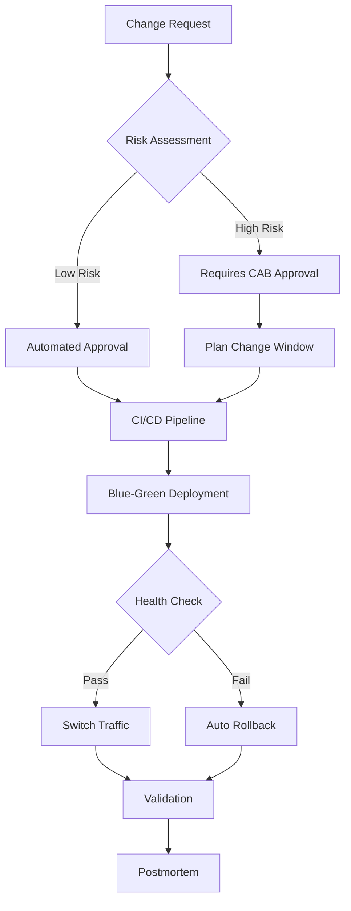

# AWS Well-Architected Framework - Reliability Pillar (2025)

> Part of the [AWS Resilience Analysis Framework Reference](resilience-framework.md).

## 1.1 Five Design Principles

### Principle 1: Automatically Recover from Failure

**Core Concept**:
- Achieve automated failure detection and recovery by monitoring Key Performance Indicators (KPIs)
- KPIs should measure business value, not technical details
- Enable automated notification, tracking, and recovery workflows
- Use predictive automation to proactively fix failures

**Implementation Points**:
```yaml
Monitoring Strategy:
  Business Metrics:
    - Order completion rate
    - User login success rate
    - Transaction processing time

  Technical Metrics:
    - CPU/memory utilization
    - Network throughput
    - Error rate

Auto Recovery:
  - Auto Scaling Groups (automatic replacement of failed instances)
  - RDS Multi-AZ (automatic failover)
  - Route 53 Health Checks (DNS failover)
  - Lambda Dead Letter Queues (failure retry)
```

### Principle 2: Test Recovery Procedures

**Core Concept**:
- Proactively validate recovery strategies in cloud environments
- Use automation to simulate various failure scenarios
- Reproduce historical failure scenarios
- Discover and fix problem paths before real failures occur

**Implementation Tools**:
- AWS Fault Injection Simulator (FIS)
- GameDays / Disaster Recovery Drills

**Test Frequency**:
- Chaos experiments: Weekly (Staging)
- DR failover drills: Monthly (partial traffic)
- Full DR drills: Quarterly (Production)
- Tabletop exercises: Monthly (theoretical scenarios)

### Principle 3: Scale Horizontally

**Core Concept**:
- Replace single large resources with multiple smaller resources
- Reduce single point of failure impact
- Distribute requests across multiple smaller resources
- Avoid shared single points of failure

**Architecture Patterns**:
```
Anti-pattern (Vertical Scaling):
+-----------------+
| Single Large    |  <- Single point of failure
| EC2 (m5.24xl)  |
+-----------------+

Best Practice (Horizontal Scaling):
+------+ +------+ +------+ +------+
| EC2  | | EC2  | | EC2  | | EC2  |  <- Redundancy and fault tolerance
|(m5.xl)|(m5.xl)|(m5.xl)|(m5.xl)|
+------+ +------+ +------+ +------+
```

### Principle 4: Stop Guessing Capacity

**Core Concept**:
- Automatically adjust resources based on monitoring
- Monitor demand and utilization
- Automatically add or remove resources
- Maintain optimal utilization
- Manage service quotas and constraints

**AWS Services**:
- AWS Auto Scaling (EC2, ECS, DynamoDB)
- Application Auto Scaling
- Predictive Scaling (ML-based prediction)
- Service Quotas (quota management)

### Principle 5: Manage Change Through Automation

**Core Concept**:
- All infrastructure changes through automation
- Use Infrastructure as Code (IaC)
- Traceable and reviewable change processes
- Reduce human errors

**Implementation Tools**:
```yaml
IaC Tools:
  - AWS CloudFormation
  - Terraform
  - AWS CDK (TypeScript/Python)
  - Pulumi

CI/CD Tools:
  - AWS CodePipeline
  - GitHub Actions
  - GitLab CI
  - Jenkins

GitOps:
  - ArgoCD
  - Flux CD
```

## 1.2 Disaster Recovery Strategies

AWS provides four primary disaster recovery strategies, in order of increasing cost and complexity:

| Strategy | RTO | RPO | Cost | Complexity | Use Case |
|----------|-----|-----|------|-----------|---------|
| **Backup & Restore** | Hours-Days | Hours-Days | $ | Low | Data loss or corruption scenarios |
| **Pilot Light** | 10 min-Hours | Minutes | $$ | Medium | Regional disasters |
| **Warm Standby** | Minutes | Seconds-Minutes | $$$ | Medium-High | Critical business systems |
| **Multi-Site Active-Active** | Seconds-Minutes | Seconds | $$$$ | High | Mission-critical systems |

### Strategy 1: Backup and Restore

**Architecture**:
```
+--------------------------------------------------+
| Primary Region (us-east-1)                        |
|  +----------+      Periodic Backup +------------+ |
|  | RDS/EBS  | ------------------->| S3 Backups  | |
|  +----------+                     +------------+ |
+--------------------------------------------------+
                       | Cross-region replication
                       v
+--------------------------------------------------+
| DR Region (us-west-2)                             |
|                    +------------+                 |
|                    | S3 Backups |                 |
|                    +------------+                 |
|                         | Restore on disaster     |
|                         v                         |
|                    +----------+                   |
|                    | RDS/EBS  |                   |
|                    +----------+                   |
+--------------------------------------------------+
```

**Implementation Points**:
- Use AWS Backup for centralized management
- Cross-Region Replication (S3 CRR)
- Must deploy with IaC (CloudFormation/CDK)
- Regularly test restore procedures

**AWS Services**:
- AWS Backup
- S3 Cross-Region Replication
- CloudFormation StackSets
- AWS Backup Vault Lock (compliance)

### Strategy 2: Pilot Light

**Architecture**:
```
Primary Region (us-east-1) - Full Operation
+-------------------------------------+
| +-----+  +-----+  +-----+          |
| | EC2 |  | EC2 |  | EC2 |  <- Running |
| +-----+  +-----+  +-----+          |
|      |       |       |              |
|      +-------+-------+              |
|              |                      |
|      +---------------+              |
|      | RDS Primary   |  <- Running  |
|      +---------------+              |
+-------------------------------------+
            | Data replication
            v
DR Region (us-west-2) - Core Always On
+-------------------------------------+
| +-----+  +-----+                    |
| | EC2 |  | EC2 |  <- Configured but stopped |
| +-----+  +-----+                    |
|                                      |
|      +---------------+              |
|      | RDS Replica   |  <- Running  |
|      +---------------+              |
+-------------------------------------+
```

**Key Characteristics**:
- Core infrastructure always on (databases, storage)
- Application servers configured but stopped
- Rapid application layer startup on failure (10-30 minutes)
- Continuous data replication, low RPO

**AWS Services**:
- Aurora Global Database
- DynamoDB Global Tables
- S3 Cross-Region Replication
- AMIs + Launch Templates

### Strategy 3: Warm Standby

**Architecture**:
```
Primary Region (us-east-1) - Full Capacity
+-------------------------------------+
| Route 53 (100% traffic)             |
|         |                           |
|    +----v-----+                     |
|    |   ALB    |                     |
|    +----+-----+                     |
| +-------+--------+                  |
| | ASG (10 inst.) |  <- Full capacity|
| +----------------+                  |
|         |                           |
|    +----v------+                    |
|    | Aurora DB |                    |
|    +-----------+                    |
+-------------------------------------+
            | Continuous replication
            v
DR Region (us-west-2) - Scaled Down
+-------------------------------------+
| Route 53 (0% traffic, health check standby) |
|         |                           |
|    +----v-----+                     |
|    |   ALB    |                     |
|    +----+-----+                     |
| +-------+--------+                  |
| | ASG (2 inst.)  |  <- 25% capacity|
| +----------------+                  |
|         |                           |
|    +----v------+                    |
|    | Aurora DB |                    |
|    +-----------+                    |
+-------------------------------------+
```

**Key Characteristics**:
- DR region has a scaled-down complete environment (typically 25-50%)
- Can handle requests without startup
- Only need to scale capacity on failure (5-10 minutes)
- Continuous data sync, very low RPO

**Failover Process**:
1. Route 53 detects primary region failure (health check fails)
2. Automatically routes DNS traffic to DR region
3. DR region Auto Scaling automatically scales to full capacity
4. No data loss (continuous replication)

### Strategy 4: Multi-Site Active-Active

**Architecture**:
```
+------------------------------------------------+
| Global Accelerator / CloudFront                 |
|  (Intelligent traffic routing: lowest latency   |
|   + health checks)                              |
+------------------------------------------------+
         |                          |
    50% traffic                 50% traffic
         |                          |
    +----v-----------------+  +-----v--------------+
    | us-east-1            |  | us-west-2          |
    | (Full capacity)      |  | (Full capacity)    |
    |                      |  |                    |
    | +--------------+     |  | +-------------+    |
    | | ASG (10 inst)|     |  | | ASG (10 inst)|   |
    | +------+-------+     |  | +------+------+   |
    |        |             |  |        |          |
    | +------v--------+   |  | +------v------+   |
    | | Aurora Global  |<--+--+| Aurora Global|   |
    | | (Writer)       | bi- | | (Read Replica|   |
    | +----------------+ dir | | can promote  |   |
    +----------------------+ | | to Writer)   |   |
                             +-+---------------+--+
```

**Key Characteristics**:
- All regions handle traffic simultaneously (no "primary" concept)
- Route 53 or Global Accelerator for intelligent routing
- DynamoDB Global Tables / Aurora Global Database
- RTO < 1 minute, RPO < 1 second
- Highest cost (2x or more)

**AWS Services**:
- AWS Global Accelerator
- Route 53 with Latency-based Routing
- Aurora Global Database
- DynamoDB Global Tables
- CloudFront

## 1.3 Fault Isolation and Multi-Location Deployment

### Multi-AZ Architecture

**Physical Isolation Characteristics**:
- Independent power supply
- Independent network connectivity
- Physical distance: kilometers to tens of kilometers
- Low latency: single-digit milliseconds (< 2ms)
- Supports synchronous replication

**Implementation**:
```yaml
Compute Layer:
  Auto Scaling:
    - Deploy across at least 3 AZs
    - Use AZ Rebalancing
    - Health checks: ELB + EC2

  ECS/EKS:
    - Tasks/Pods distributed across AZs
    - Service Mesh failover

Load Balancing:
  ALB/NLB:
    - At least 2 AZs
    - Cross-Zone Load Balancing enabled
    - Health check configuration

Data Layer:
  RDS Multi-AZ:
    - Synchronous replication
    - Automatic failover (60-120 seconds)

  Aurora:
    - 6 replicas across 3 AZs
    - Self-healing storage
    - Failover < 30 seconds
```

### Multi-Region Architecture

**Applicable Scenarios**:
- Critical infrastructure (finance, healthcare)
- Strict SLA requirements (99.99%+)
- Global users requiring low latency
- Compliance requirements (data residency)

**Key Components**:

| Requirement | AWS Service | Description |
|-------------|-----------|-------------|
| Infrastructure Replication | CloudFormation StackSets | Deploy identical infrastructure across regions |
| Data Replication | DynamoDB Global Tables | Multi-master replication, < 1s latency |
| | Aurora Global Database | Cross-region replication, < 1s latency |
| | S3 Cross-Region Replication | Object storage replication |
| Traffic Routing | Route 53 | Health checks + failover |
| | Global Accelerator | Anycast IP + automatic failover |
| | CloudFront | CDN + Origin Failover |
| DR Orchestration | AWS Resilience Hub | Automated assessment and recommendations |
| | Application Recovery Controller | Cross-region traffic control |

**Implementation Example (Active-Passive)**:

```yaml
# CloudFormation StackSet Parameters
Regions:
  Primary: us-east-1
  Secondary: us-west-2

Deployment:
  Primary:
    Capacity: 100%
    TrafficWeight: 100%

  Secondary:
    Capacity: 25%
    TrafficWeight: 0%  # Standby

Failover:
  Trigger: Route 53 Health Check Failure
  Actions:
    - Update Route 53 DNS (60s TTL)
    - Scale Secondary to 100%
    - Promote Aurora Read Replica to Writer
  ExpectedRTO: 5 minutes
```

## 1.4 Change Management

**Three Key Best Practice Areas**:

### 1. Monitor Workload Resources

**Key Monitoring Signals**:

| Signal | Description | CloudWatch Metric | Alarm Threshold |
|--------|-------------|-------------------|-----------------|
| **Latency** | Request response time | TargetResponseTime | P95 > 200ms |
| **Traffic** | System demand | RequestCount | Spike > 200% |
| **Errors** | Failed request rate | HTTPCode_5XX_Count | > 1% |
| **Saturation** | Resource utilization | CPUUtilization | > 80% |

**Implementation**:
```yaml
CloudWatch Dashboard:
  - Golden signals overview
  - Grouped by service
  - Real-time and historical trends
  - Correlated logs and traces

CloudWatch Alarms:
  - Composite alarms (multi-metric)
  - Anomaly detection (ML-driven)
  - Multi-window alarms (avoid flapping)

X-Ray:
  - Distributed tracing
  - Service map
  - Latency analysis
```

### 2. Design Adaptive Workloads

**Elasticity Patterns**:

```yaml
Auto Scaling Strategies:
  Target Tracking:
    - CPU utilization target: 70%
    - ALB request count: 1000/instance
    - Custom metrics (queue depth)

  Step Scaling:
    - Rapid response to burst traffic
    - Stepped scaling

  Scheduled Scaling:
    - Known peak periods
    - Pre-scaling

  Predictive Scaling:
    - ML-predicted future load
    - Pre-scaling

Load Balancing:
  - ALB: HTTP/HTTPS applications
  - NLB: TCP/UDP, ultra-low latency
  - GWLB: Security appliance integration
  - Connection Draining: Graceful shutdown
```

### 3. Implement Changes

**Structured Change Management Process**:



**Emergency Measures (REL05-BP07)**:

```yaml
Rollback Plan:
  Automatic Rollback Triggers:
    - Error rate > 1%
    - Latency P95 > 2x baseline
    - Health check failures > 20%

  Rollback Methods:
    - Blue-green deployment: Switch traffic to previous version
    - Canary: Stop rollout, rollback
    - CloudFormation: StackSet rollback

  Rollback Time Target: < 5 minutes

Circuit Breaking:
  - Each change impacts < 10% traffic
  - Phased rollout (1% -> 10% -> 50% -> 100%)
  - Validation period per phase: 30 minutes
  - Auto-stop on any phase failure
```

---

## DR Cost Reference Baselines

Approximate cost multipliers (actual costs vary significantly by service and usage pattern):

| DR Strategy | Cost Multiplier vs. Single-Region | Typical Use Case |
|-------------|----------------------------------|-----------------|
| Backup & Restore | ~1.1x | Non-critical workloads, RTO > 24h |
| Pilot Light | ~1.1-1.2x | Important workloads, RTO 1-4h |
| Warm Standby | ~1.3-1.5x | Business-critical, RTO 15min-1h |
| Multi-AZ (same region) | ~1.5-2x | Production standard |
| Multi-Region Active-Active | ~2.5-3x | Mission-critical, RTO < 5min |
