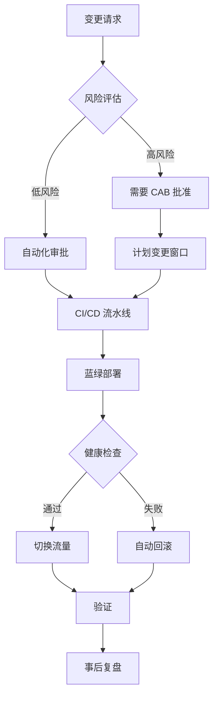

# AWS Well-Architected Framework - 可靠性支柱 (2025)

> 属于 [AWS 韧性分析框架参考](resilience-framework_zh.md) 的一部分。

## 1. AWS Well-Architected Framework - 可靠性支柱 (2025)

### 1.1 五大设计原则

#### 原则 1：自动从故障中恢复 (Automatically Recover from Failure)

**核心理念**：
- 通过监控关键性能指标 (KPIs) 实现自动化故障检测和恢复
- KPIs 应衡量业务价值而非技术细节
- 启用自动通知、追踪和恢复流程
- 使用预测性自动化提前修复故障

**实施要点**：
```yaml
监控策略:
  业务指标:
    - 订单完成率
    - 用户登录成功率
    - 交易处理时间

  技术指标:
    - CPU/内存利用率
    - 网络吞吐量
    - 错误率

自动恢复:
  - Auto Scaling Groups (自动替换故障实例)
  - RDS Multi-AZ (自动故障转移)
  - Route 53 Health Checks (DNS 故障转移)
  - Lambda Dead Letter Queues (失败重试)
```

#### 原则 2：测试恢复流程 (Test Recovery Procedures)

**核心理念**：
- 在云环境中主动验证恢复策略
- 使用自动化模拟各种故障场景
- 重现历史故障场景
- 在真实故障发生前发现并修复问题路径

**实施工具**：
- AWS Fault Injection Simulator (FIS)
- GameDays / Disaster Recovery Drills

**测试频率**：
- 混沌实验：每周（Staging）
- DR 切换演练：每月（部分流量）
- 完整 DR 演练：每季度（生产环境）
- 桌面演练：每月（理论场景）

#### 原则 3：水平扩展 (Scale Horizontally)

**核心理念**：
- 使用多个小资源替代单个大资源
- 降低单点故障影响
- 跨多个小资源分发请求
- 避免共享单点故障

**架构模式**：
```
反模式（垂直扩展）:
┌─────────────────┐
│  单个大型 EC2   │  ← 单点故障
│  (m5.24xlarge)  │
└─────────────────┘

最佳实践（水平扩展）:
┌──────┐ ┌──────┐ ┌──────┐ ┌──────┐
│ EC2  │ │ EC2  │ │ EC2  │ │ EC2  │  ← 冗余和容错
│(m5.xl)│(m5.xl)│(m5.xl)│(m5.xl)│
└──────┘ └──────┘ └──────┘ └──────┘
```

#### 原则 4：停止猜测容量 (Stop Guessing Capacity)

**核心理念**：
- 基于监控自动调整资源
- 监控需求和利用率
- 自动添加或移除资源
- 维持最优利用率
- 管理服务配额和约束

**AWS 服务**：
- AWS Auto Scaling（EC2、ECS、DynamoDB）
- Application Auto Scaling
- Predictive Scaling（基于 ML 预测）
- Service Quotas（配额管理）

#### 原则 5：通过自动化管理变更 (Manage Change Through Automation)

**核心理念**：
- 所有基础设施变更通过自动化进行
- 使用基础设施即代码 (IaC)
- 可追踪和审查的变更过程
- 减少人为错误

**实施工具**：
```yaml
IaC 工具:
  - AWS CloudFormation
  - Terraform
  - AWS CDK (TypeScript/Python)
  - Pulumi

CI/CD 工具:
  - AWS CodePipeline
  - GitHub Actions
  - GitLab CI
  - Jenkins

GitOps:
  - ArgoCD
  - Flux CD
```

### 1.2 灾难恢复策略

AWS 提供四种主要灾难恢复策略，按成本和复杂度递增：

| 策略 | RTO | RPO | 成本 | 复杂度 | 适用场景 |
|------|-----|-----|------|--------|---------|
| **备份与恢复** | 小时-天 | 小时-天 | $ | 低 | 数据丢失或损坏场景 |
| **导航灯 (Pilot Light)** | 10分钟-小时 | 分钟 | $$ | 中 | 区域灾难 |
| **温备份 (Warm Standby)** | 分钟 | 秒-分钟 | $$$ | 中-高 | 关键业务系统 |
| **多站点主动-主动** | 秒-分钟 | 秒 | $$$$ | 高 | 任务关键系统 |

#### 策略 1：备份与恢复 (Backup and Restore)

**架构**：
```
┌─────────────────────────────────────────────────┐
│ 主区域 (us-east-1)                              │
│  ┌──────────┐      定期备份     ┌────────────┐ │
│  │ RDS/EBS  │ ──────────────────>│ S3 Backups │ │
│  └──────────┘                    └────────────┘ │
└─────────────────────────────────────────────────┘
                       │ 跨区域复制
                       ▼
┌─────────────────────────────────────────────────┐
│ DR 区域 (us-west-2)                             │
│                    ┌────────────┐               │
│                    │ S3 Backups │               │
│                    └────────────┘               │
│                         │ 灾难时恢复             │
│                         ▼                        │
│                    ┌──────────┐                 │
│                    │ RDS/EBS  │                 │
│                    └──────────┘                 │
└─────────────────────────────────────────────────┘
```

**实施要点**：
- 使用 AWS Backup 集中管理
- 跨区域复制 (S3 CRR)
- 必须使用 IaC 部署 (CloudFormation/CDK)
- 定期测试恢复流程

**AWS 服务**：
- AWS Backup
- S3 Cross-Region Replication
- CloudFormation StackSets
- AWS Backup Vault Lock (合规)

#### 策略 2：导航灯 (Pilot Light)

**架构**：
```
主区域 (us-east-1) - 完整运行
┌─────────────────────────────────────┐
│ ┌─────┐  ┌─────┐  ┌─────┐          │
│ │ EC2 │  │ EC2 │  │ EC2 │  ← 运行  │
│ └─────┘  └─────┘  └─────┘          │
│      │       │       │              │
│      └───────┴───────┘              │
│              │                      │
│      ┌───────────────┐              │
│      │ RDS Primary   │  ← 运行     │
│      └───────────────┘              │
└─────────────────────────────────────┘
            │ 数据复制
            ▼
DR 区域 (us-west-2) - 核心始终在线
┌─────────────────────────────────────┐
│ ┌─────┐  ┌─────┐                   │
│ │ EC2 │  │ EC2 │  ← 已配置但关闭   │
│ └─────┘  └─────┘                   │
│                                     │
│      ┌───────────────┐              │
│      │ RDS Replica   │  ← 运行     │
│      └───────────────┘              │
└─────────────────────────────────────┘
```

**核心特点**：
- 核心基础设施始终在线（数据库、存储）
- 应用服务器已配置但关闭
- 故障时快速启动应用层（10-30 分钟）
- 数据持续复制，RPO 低

**AWS 服务**：
- Aurora Global Database
- DynamoDB Global Tables
- S3 Cross-Region Replication
- AMIs + Launch Templates

#### 策略 3：温备份 (Warm Standby)

**架构**：
```
主区域 (us-east-1) - 完整容量
┌─────────────────────────────────────┐
│ Route 53 (100% 流量)                │
│         │                            │
│    ┌────▼─────┐                     │
│    │   ALB    │                     │
│    └────┬─────┘                     │
│ ┌───────┴────────┐                 │
│ │ ASG (10 实例)  │  ← 完整容量     │
│ └────────────────┘                 │
│         │                            │
│    ┌────▼──────┐                    │
│    │ Aurora DB │                    │
│    └───────────┘                    │
└─────────────────────────────────────┘
            │ 持续复制
            ▼
DR 区域 (us-west-2) - 缩小规模运行
┌─────────────────────────────────────┐
│ Route 53 (0% 流量，健康检查待命)   │
│         │                            │
│    ┌────▼─────┐                     │
│    │   ALB    │                     │
│    └────┬─────┘                     │
│ ┌───────┴────────┐                 │
│ │ ASG (2 实例)   │  ← 25% 容量     │
│ └────────────────┘                 │
│         │                            │
│    ┌────▼──────┐                    │
│    │ Aurora DB │                    │
│    └───────────┘                    │
└─────────────────────────────────────┘
```

**核心特点**：
- DR 区域拥有缩小规模的完整环境（通常 25-50%）
- 无需启动即可处理请求
- 故障时仅需扩展容量（5-10 分钟）
- 持续数据同步，RPO 非常低

**故障转移流程**：
1. Route 53 检测主区域故障（健康检查失败）
2. 自动将 DNS 流量路由到 DR 区域
3. DR 区域 Auto Scaling 自动扩展到完整容量
4. 无数据丢失（持续复制）

#### 策略 4：多站点主动-主动 (Multi-Site Active-Active)

**架构**：
```
┌────────────────────────────────────────────────┐
│ Global Accelerator / CloudFront                │
│  (智能流量路由：延迟最低 + 健康检查)           │
└────────────────────────────────────────────────┘
         │                          │
    50% 流量                    50% 流量
         │                          │
    ┌────▼─────────────┐    ┌──────▼──────────┐
    │ us-east-1        │    │ us-west-2       │
    │ (完整容量)        │    │ (完整容量)       │
    │                  │    │                 │
    │ ┌──────────────┐ │    │ ┌─────────────┐│
    │ │ ASG (10实例) │ │    │ │ ASG (10实例)││
    │ └──────┬───────┘ │    │ └──────┬──────┘│
    │        │          │    │        │       │
    │ ┌──────▼────────┐│    │ ┌──────▼──────┐│
    │ │ Aurora Global ││◄───┼─┤Aurora Global││
    │ │ (Writer)      ││双向││ │(Read Replica││
    │ └───────────────┘│同步││ │可晋升为Writer│
    └───────────────────┘    └─────────────────┘
```

**核心特点**：
- 所有区域同时处理流量（无"主"概念）
- 使用 Route 53 或 Global Accelerator 智能路由
- DynamoDB Global Tables / Aurora Global Database
- RTO < 1 分钟，RPO < 1 秒
- 成本最高（2x 或更多）

**AWS 服务**：
- AWS Global Accelerator
- Route 53 with Latency-based Routing
- Aurora Global Database
- DynamoDB Global Tables
- CloudFront

### 1.3 故障隔离与多位置部署

#### 多可用区 (Multi-AZ) 架构

**物理隔离特性**：
- 独立电力供应
- 独立网络连接
- 物理距离：数公里到数十公里
- 低延迟：个位数毫秒 (< 2ms)
- 支持同步复制

**实施方式**：
```yaml
计算层:
  Auto Scaling:
    - 跨至少 3 个 AZ 部署
    - 使用 AZ Rebalancing
    - 健康检查：ELB + EC2

  ECS/EKS:
    - 任务/Pod 跨 AZ 分布
    - Service Mesh 故障转移

负载均衡:
  ALB/NLB:
    - 至少 2 个 AZ
    - Cross-Zone Load Balancing 启用
    - 健康检查配置

数据层:
  RDS Multi-AZ:
    - 同步复制
    - 自动故障转移 (60-120 秒)

  Aurora:
    - 6 副本跨 3 AZ
    - 自愈存储
    - 故障转移 < 30 秒
```

#### 多区域 (Multi-Region) 架构

**适用场景**：
- 关键基础设施（金融、医疗）
- 严格 SLA 要求（99.99%+）
- 全球用户低延迟
- 合规要求（数据驻留）

**关键组件**：

| 需求 | AWS 服务 | 说明 |
|------|---------|------|
| 基础设施复制 | CloudFormation StackSets | 跨区域部署相同基础设施 |
| 数据复制 | DynamoDB Global Tables | 多主复制，< 1s 延迟 |
| | Aurora Global Database | 跨区域复制，< 1s 延迟 |
| | S3 Cross-Region Replication | 对象存储复制 |
| 流量路由 | Route 53 | 健康检查 + 故障转移 |
| | Global Accelerator | Anycast IP + 自动故障转移 |
| | CloudFront | CDN + Origin Failover |
| DR 编排 | AWS Resilience Hub | 自动评估和改进建议 |
| | Application Recovery Controller | 跨区域流量控制 |

**实施示例（Active-Passive）**：

```yaml
# CloudFormation StackSet 参数
Regions:
  Primary: us-east-1
  Secondary: us-west-2

Deployment:
  Primary:
    Capacity: 100%
    TrafficWeight: 100%

  Secondary:
    Capacity: 25%
    TrafficWeight: 0%  # 待命

Failover:
  Trigger: Route 53 Health Check Failure
  Actions:
    - Update Route 53 DNS (60s TTL)
    - Scale Secondary to 100%
    - Promote Aurora Read Replica to Writer
  ExpectedRTO: 5 minutes
```

### 1.4 变更管理

**三大最佳实践领域**：

#### 1. 监控工作负载资源

**关键监控指标**：

| 信号 | 描述 | CloudWatch 指标 | 告警阈值 |
|------|------|----------------|---------|
| **延迟** | 请求响应时间 | TargetResponseTime | P95 > 200ms |
| **流量** | 系统需求 | RequestCount | 突增 > 200% |
| **错误** | 失败请求率 | HTTPCode_5XX_Count | > 1% |
| **饱和度** | 资源利用率 | CPUUtilization | > 80% |

**实施**：
```yaml
CloudWatch 仪表板:
  - 黄金信号概览
  - 按服务分组
  - 实时和历史趋势
  - 关联日志和追踪

CloudWatch Alarms:
  - 复合告警（多指标）
  - 异常检测（ML 驱动）
  - 多窗口告警（避免抖动）

X-Ray:
  - 分布式追踪
  - 服务地图
  - 延迟分析
```

#### 2. 设计自适应工作负载

**弹性模式**：

```yaml
Auto Scaling 策略:
  Target Tracking:
    - CPU 利用率目标：70%
    - ALB 请求计数：1000/实例
    - 自定义指标（队列深度）

  Step Scaling:
    - 快速响应突发流量
    - 阶梯式扩展

  Scheduled Scaling:
    - 已知高峰时段
    - 提前扩容

  Predictive Scaling:
    - ML 预测未来负载
    - 提前扩容

负载均衡:
  - ALB：HTTP/HTTPS 应用
  - NLB：TCP/UDP，极低延迟
  - GWLB：安全设备集成
  - Connection Draining：优雅停止
```

#### 3. 实施变更

**结构化变更管理流程**：



**应急措施（REL05-BP07）**：

```yaml
回滚计划:
  自动回滚触发器:
    - 错误率 > 1%
    - 延迟 P95 > 2x 基线
    - 健康检查失败 > 20%

  回滚方法:
    - 蓝绿部署：切换流量到旧版本
    - 金丝雀：停止推出，回退
    - CloudFormation：StackSet 回滚

  回滚时间目标: < 5 分钟

熔断机制:
  - 每次变更影响 < 10% 流量
  - 分阶段推出（1% → 10% → 50% → 100%）
  - 每阶段验证期：30 分钟
  - 任何阶段失败自动停止
```

---


## DR 成本参考基线

近似成本倍率（实际成本因服务和使用模式而异）：

| DR 策略 | 相对单区域成本倍率 | 典型场景 |
|---------|------------------|---------|
| 备份恢复 (Backup & Restore) | ~1.1x | 非关键工作负载，RTO > 24h |
| 先导灯 (Pilot Light) | ~1.1-1.2x | 重要工作负载，RTO 1-4h |
| 温备 (Warm Standby) | ~1.3-1.5x | 业务关键，RTO 15min-1h |
| 多 AZ（同区域） | ~1.5-2x | 生产环境标准配置 |
| 多区域主动-主动 | ~2.5-3x | 任务关键，RTO < 5min |
