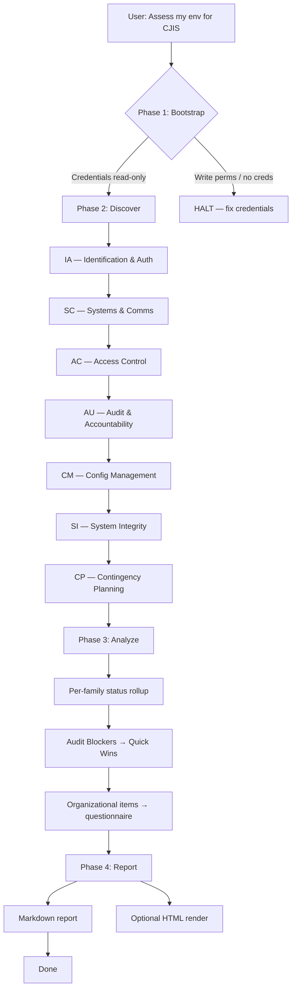

# Workflow Overview

> Based on CJIS Security Policy v6.0 (effective December 2024).
> Last verified against official source: 2026-05-21.
> Check https://le.fbi.gov/cjis-division/cjis-security-policy-resource-center for newer versions.

## 4-Phase Assessment Flow

```
Phase 1: Bootstrap  (~2 min)     → Credential gate + scope confirmation (human-in-loop)
Phase 2: Discover   (~10-40 min) → Per-family programmatic scan (automated)
Phase 3: Analyze    (~5 min)     → Gap consolidation + remediation roadmap (automated)
Phase 4: Report     (~2 min)     → Markdown report, optional HTML render (automated)
```



## Phase details

### Phase 1: Bootstrap (~2 min)
- **Human interaction**: YES (only phase that needs it)
- **Inputs**: AWS credentials, target account/region(s), scope
- **Outputs**: Validated environment config
- **Can fail**: Yes — credential boundary violation or missing CLI
- Steps:
  1. Verify `aws --version`
  2. `aws sts get-caller-identity` — record ARN, account, region
  3. Validate against [`credential-boundary.md`](credential-boundary.md) — HALT if write-capable
  4. Confirm scope with user: account(s), region(s), which families (default = P1 + P2 technical families), GovCloud vs commercial
  5. Confirm state CSA (affects Section 5.1 addendum check)

### Phase 2: Discover (~10-40 min)
- **Human interaction**: NO
- **Inputs**: Bootstrap config
- **Outputs**: Per-family findings with severity
- **Order** (by priority and audit impact):
  1. IA (P1 — #1 audit finding area)
  2. SC (P1 — boundary + encryption)
  3. AC (P1 — access control)
  4. AU (P2 — auditing)
  5. CM (P1 — config management)
  6. SI (P1 — flaw remediation)
  7. CP (P2 — contingency)
- **Execution rules**:
  - Load each family's check file on demand from `references/programmatic-checks/`
  - Do NOT preload all check files — context blows up on a 7-family scan
  - Each check records a result: `COMPLIANT` / `NON_COMPLIANT` / `NOT_APPLICABLE` / `UNABLE_TO_ASSESS`
  - Per-finding severity per [`severity-classification.md`](severity-classification.md)
  - Emit a short per-family summary before moving to the next family
  - If AccessDenied on a check → mark `UNABLE_TO_ASSESS` and continue (do not halt)

### Phase 3: Analyze (~5 min)
- **Human interaction**: NO
- **Inputs**: All per-family findings
- **Outputs**: Gap table, roadmap, questionnaire items
- Steps:
  1. Roll up per-family status (Compliant / Substantially Compliant / At Risk / Non-Compliant / Not Assessed)
  2. Extract Audit Blockers across all families → top of the remediation roadmap
  3. Group remediation into phases: Immediate (0-2 wks), Short-term (2-8 wks), Medium-term (2-6 mo), Long-term (6-12 mo)
  4. Surface organizational items (Section 5.1, AT, PE, PS, IR, MA, PL, SA, SR, CA) as questionnaire items for the user

### Phase 4: Report (~2 min)
- **Human interaction**: NO
- **Inputs**: Analysis output
- **Outputs**: Markdown report (always), HTML report (on request)
- Generate per [`report-template.md`](report-template.md)
- Default output dir: `cjis-reports/`
- HTML render: `python3 scripts/generate-html-report.py cjis-reports/cjis-assessment-{date}.md`

## Assessment modes

| Mode | Families covered | Time | When to use |
|---|---|---|---|
| **Quick Scan** | IA + SC + AC (P1 families only) | ~10 min | "Am I going to fail a CJIS audit?" — hits the 3 highest-risk P1 families |
| **Standard** | IA + SC + AC + AU + CM + SI | ~25 min | Default. Covers all P1 families + AU (critical P2) |
| **Full** | Standard + CP + questionnaire for AT, PE, PS, IR, MA, PL, SA, SR, CA | ~40 min | Pre-audit readiness — all technical + organizational |
| **Questionnaire only** | Organizational families | ~15 min | No AWS access or write-only creds — walk through readiness-checklist.md |

## Priority-First ordering rationale

The family order in Standard/Full mode is priority-and-audit-heat-weighted:

1. **IA (P1)** first — #1 audit finding nationwide. MFA gaps are the most common audit failure.
2. **SC (P1)** — boundary protection + encryption at rest/transit. FIPS compliance is binary.
3. **AC (P1)** — access control, public exposure, least privilege.
4. **AU (P2)** — auditing. Without logging, nothing else can be verified at audit.
5. **CM (P1)** — config management, patching. Pulls EC2/SSM data that can take longest.
6. **SI (P1)** — flaw remediation, monitoring. Depends on Inspector/GuardDuty state.
7. **CP (P2)** — contingency planning. Backup verification, least likely to be an Audit Blocker.

This order maximizes value when a scan is interrupted — the highest-risk findings surface first.

## Error handling

| Error | Action |
|---|---|
| AccessDenied on a check | Mark `UNABLE_TO_ASSESS`, include the error, continue |
| API throttling (429) | AWS CLI handles backoff; retry once |
| Service not in region | Mark `NOT_APPLICABLE` with a region note |
| Check timeout | Retry once with longer timeout, then `UNABLE_TO_ASSESS` |
| Credentials expired mid-scan | HALT, ask user to refresh, resume |
| No resources of the type (e.g., no RDS instances) | Mark `NOT_APPLICABLE`, do not treat as finding |

## Multi-account / multi-region

- Multi-account: run bootstrap + discover per account, then merge findings in Phase 3 with a per-account column in the report.
- Multi-region: run discover per region sequentially; most CJIS resources should be in a single region anyway, but global services (IAM, CloudTrail org trails, S3) are assessed once.
- If the user mentions an AWS Organizations structure, ask whether to cover just the CJI OU or all accounts — default to CJI OU only.
