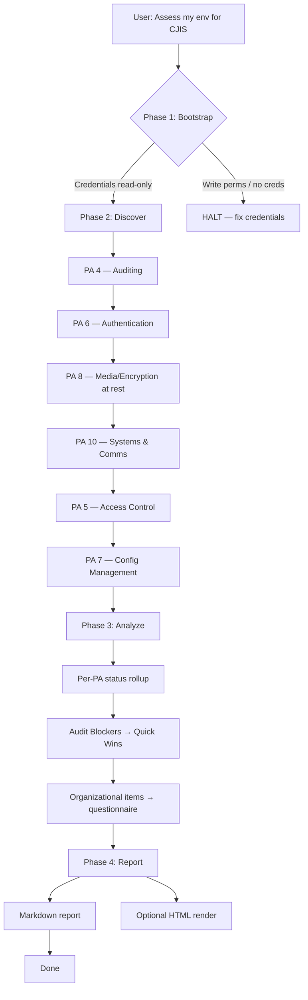

# Workflow Overview

## 4-Phase Assessment Flow

```
Phase 1: Bootstrap  (~2 min)     → Credential gate + scope confirmation (human-in-loop)
Phase 2: Discover   (~10-25 min) → Per-PA programmatic scan (automated)
Phase 3: Analyze    (~5 min)     → Gap consolidation + remediation roadmap (automated)
Phase 4: Report     (~2 min)     → Markdown report, optional HTML render (automated)
```



## Phase details

### Phase 1: Bootstrap (~2 min)
- **Human interaction**: YES (only phase that needs it)
- **Inputs**: AWS credentials, target account/region(s), scope
- **Outputs**: Validated environment config
- **Can fail**: Yes — credential boundary violation or missing CLI
- Steps:
  1. Verify `aws --version`
  2. `aws sts get-caller-identity` — record ARN, account, region
  3. Validate against [`credential-boundary.md`](credential-boundary.md) — HALT if write-capable
  4. Confirm scope with user: account(s), region(s), which PAs (default = audit-heavy set), GovCloud vs commercial
  5. Confirm state CSA (affects PA 1 addendum check)

### Phase 2: Discover (~10-25 min)
- **Human interaction**: NO
- **Inputs**: Bootstrap config
- **Outputs**: Per-PA findings with severity
- **Order**: PA 4 → 6 → 8 → 10 → 5 → 7 (audit-heat order — gets the critical findings early so a long scan doesn't waste time)
- **Execution rules**:
  - Load each PA's check file on demand from `references/programmatic-checks/`
  - Do NOT preload all check files — context blows up on a 6-PA scan
  - Each check records a result: `COMPLIANT` / `NON_COMPLIANT` / `NOT_APPLICABLE` / `UNABLE_TO_ASSESS`
  - Per-finding severity per [`severity-classification.md`](severity-classification.md)
  - Emit a short per-PA summary before moving to the next PA
  - If AccessDenied on a check → mark `UNABLE_TO_ASSESS` and continue (do not halt)

### Phase 3: Analyze (~5 min)
- **Human interaction**: NO
- **Inputs**: All per-PA findings
- **Outputs**: Gap table, roadmap, questionnaire items
- Steps:
  1. Roll up per-PA status (Compliant / Substantially Compliant / At Risk / Non-Compliant / Not Assessed)
  2. Extract Audit Blockers across all PAs → top of the remediation roadmap
  3. Group remediation into phases: Immediate (0-2 wks), Short-term (2-8 wks), Medium-term (2-6 mo), Long-term (6-12 mo)
  4. Surface organizational items (PA 1, 2, 11, 12, 13 mostly) as questionnaire items for the user

### Phase 4: Report (~2 min)
- **Human interaction**: NO
- **Inputs**: Analysis output
- **Outputs**: Markdown report (always), HTML report (on request)
- Generate per [`report-template.md`](report-template.md)
- Default output dir: `cjis-reports/`
- HTML render: `python3 scripts/generate-html-report.py cjis-reports/cjis-assessment-{date}.md`

## Assessment modes

| Mode | PAs covered | Time | When to use |
|---|---|---|---|
| **Quick Scan** | PA 4, 6, 8, 10 | ~10 min | "Am I going to fail a CJIS audit?" — hits the 4 audit-heat-heavy PAs |
| **Standard** | PA 4, 5, 6, 7, 8, 10 | ~20-25 min | Default. Covers all technically-assessable PAs |
| **Full** | All 13 PAs (standard + questionnaire for 1, 2, 3, 9, 11, 12, 13) | ~30-40 min | Pre-audit readiness |
| **Questionnaire only** | Organizational PAs | ~15 min | No AWS access or write-only creds — walk through readiness-checklist.md |

## Security-First ordering rationale

The PA order in Standard/Full mode is audit-heat-weighted, not numeric:

1. **PA 4 (Auditing)** first because without logging nothing else can be verified
2. **PA 6 (Authentication)** — #1 audit finding nationwide
3. **PA 8 + PA 10 (Encryption at rest + in transit)** — pair together; both FIPS-dependent
4. **PA 5 (Access Control)** — depends on PA 6 auth being established
5. **PA 7 (Config Management)** — last because it pulls data on EC2/patch state that can take the longest

This deviates from numeric PA order intentionally — the WAR skill uses Security-First for the same reason, and for CJIS the audit-heat order maximizes value when a scan is interrupted.

## Error handling

| Error | Action |
|---|---|
| AccessDenied on a check | Mark `UNABLE_TO_ASSESS`, include the error, continue |
| API throttling (429) | AWS CLI handles backoff; retry once |
| Service not in region | Mark `NOT_APPLICABLE` with a region note |
| Check timeout | Retry once with longer timeout, then `UNABLE_TO_ASSESS` |
| Credentials expired mid-scan | HALT, ask user to refresh, resume |
| No resources of the type (e.g., no RDS instances) | Mark `NOT_APPLICABLE`, do not treat as finding |

## Multi-account / multi-region

- Multi-account: run bootstrap + discover per account, then merge findings in Phase 3 with a per-account column in the report.
- Multi-region: run discover per region sequentially; most CJIS resources should be in a single region anyway, but global services (IAM, CloudTrail org trails, S3) are assessed once.
- If the user mentions an AWS Organizations structure, ask whether to cover just the CJI OU or all accounts — default to CJI OU only.
