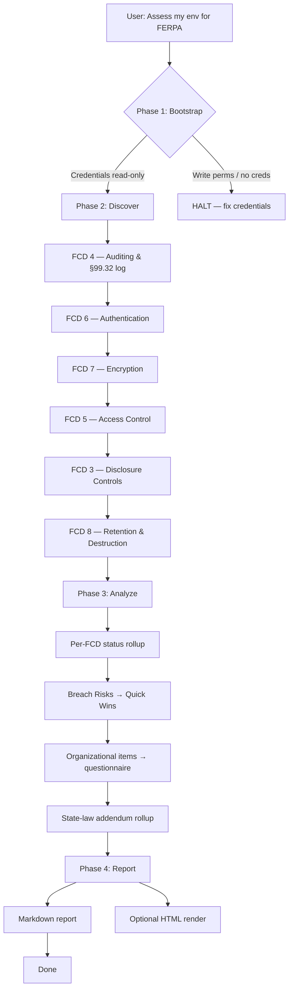

# Workflow Overview

## 4-Phase Assessment Flow

```
Phase 1: Bootstrap  (~2 min)     → Credential gate + scope confirmation (human-in-loop)
Phase 2: Discover   (~10-25 min) → Per-FCD programmatic scan (automated)
Phase 3: Analyze    (~5 min)     → Gap consolidation + remediation roadmap (automated)
Phase 4: Report     (~2 min)     → Markdown report, optional HTML render (automated)
```



## Phase details

### Phase 1: Bootstrap (~2 min)
- **Human interaction**: YES (only phase that needs it)
- **Inputs**: AWS credentials, target account/region(s), scope, role (vendor / K-12 / higher-ed), state(s)
- **Outputs**: Validated environment config
- **Can fail**: Yes — credential boundary violation or missing CLI
- Steps:
  1. Verify `aws --version`
  2. `aws sts get-caller-identity` — record ARN, account, region
  3. Validate against [`credential-boundary.md`](credential-boundary.md) — HALT if write-capable
  4. Region residency check — is the caller in a US region?
  5. Confirm scope with user: role (vendor / K-12 / higher-ed), account(s), region(s), mode, state(s), student-data stores, COPPA scope flag

### Phase 2: Discover (~10-25 min)
- **Human interaction**: NO
- **Inputs**: Bootstrap config
- **Outputs**: Per-FCD findings with severity
- **Order**: FCD 4 → 6 → 7 → 5 → 3 → 8 (breach-risk-heat order — gets the critical findings early so a long scan doesn't waste time)
- **Execution rules**:
  - Load each FCD's check file on demand from `references/programmatic-checks/`
  - Do NOT preload all check files — context blows up on a 6-FCD scan
  - Each check records a result: `COMPLIANT` / `NON_COMPLIANT` / `NOT_APPLICABLE` / `UNABLE_TO_ASSESS`
  - Per-finding severity per [`severity-classification.md`](severity-classification.md)
  - Emit a short per-FCD summary before moving to the next FCD
  - If AccessDenied on a check → mark `UNABLE_TO_ASSESS` and continue (do not halt)

### Phase 3: Analyze (~5 min)
- **Human interaction**: NO
- **Inputs**: All per-FCD findings
- **Outputs**: Gap table, roadmap, questionnaire items, state-law rollup
- Steps:
  1. Roll up per-FCD status (Compliant / Substantially Compliant / At Risk / Non-Compliant / Not Assessed)
  2. Extract Breach Risks across all FCDs → top of the remediation roadmap
  3. Group remediation into phases: Immediate (0-2 wks), Short-term (2-8 wks), Medium-term (2-6 mo), Long-term (6-12 mo)
  4. Surface organizational items (FCD 1, 2, 9, 10) as questionnaire items for the user
  5. For each state declared in Phase 1, produce a state-law addendum section referencing [`state-law-addenda.md`](state-law-addenda.md)

### Phase 4: Report (~2 min)
- **Human interaction**: NO
- **Inputs**: Analysis output
- **Outputs**: Markdown report (always), HTML report (on request)
- Generate per [`report-template.md`](report-template.md)
- Default output dir: `ferpa-reports/`
- HTML render: `python3 scripts/generate-html-report.py ferpa-reports/ferpa-assessment-{date}.md`

## Assessment modes

| Mode | FCDs covered | Time | When to use |
|---|---|---|---|
| **Quick Scan** | FCD 4, 5, 6, 7 | ~10 min | "Am I at breach risk?" — hits the 4 FCDs that drive the bulk of real-world EdTech data-breach notices |
| **Standard** | FCD 3, 4, 5, 6, 7, 8 | ~20-25 min | Default. Covers all technically-assessable FCDs |
| **Full** | All 10 FCDs (standard + questionnaire for 1, 2, 9, 10) | ~30-40 min | Pre-DPA, annual attestation, SPPO response |
| **Questionnaire only** | Organizational FCDs | ~15 min | No AWS access — walk through readiness-checklist.md |

## Breach-risk-first ordering rationale

The FCD order in Standard/Full mode is breach-risk-weighted, not numeric:

1. **FCD 4 (Auditing & §99.32)** first because without the disclosure log nothing else FERPA-specific can be verified
2. **FCD 6 (Authentication)** — credential compromise drives most breach incidents
3. **FCD 7 (Encryption)** — unencrypted-S3-exposed-to-internet is breach vector #1 in state-AG notifications
4. **FCD 5 (Access Control)** — depends on FCD 6 auth being established
5. **FCD 3 (Disclosure Controls)** — cross-account and subprocessor exposure
6. **FCD 8 (Retention)** — last because it reads data catalogs and lifecycle configs that are lower-urgency

This deviates from numeric FCD order intentionally — the audit-heat order maximizes value when a scan is interrupted.

## Error handling

| Error | Action |
|---|---|
| AccessDenied on a check | Mark `UNABLE_TO_ASSESS`, include the error, continue |
| API throttling (429) | AWS CLI handles backoff; retry once |
| Service not in region | Mark `NOT_APPLICABLE` with a region note |
| Check timeout | Retry once with longer timeout, then `UNABLE_TO_ASSESS` |
| Credentials expired mid-scan | HALT, ask user to refresh, resume |
| No resources of the type (e.g., no RDS instances) | Mark `NOT_APPLICABLE`, do not treat as finding |

## Multi-account / multi-region

- **Multi-account**: run bootstrap + discover per account, then merge findings in Phase 3 with a per-account column in the report. Common vendor pattern: one dedicated student-data account per tier (dev/stage/prod) or per district (for strict isolation).
- **Multi-region**: run discover per region sequentially; most student-data resources should be in a single US region anyway, but global services (IAM, CloudTrail org trails, S3) are assessed once.
- If the user mentions an AWS Organizations structure, ask whether to cover just the student-data OU or all accounts — default to student-data OU only.

## Role-specific emphasis

Phase 1 asks the user's role (vendor / K-12 / higher-ed). The questionnaire in Phase 3 adapts:

| Role | Emphasis |
|---|---|
| **EdTech vendor** | FCD 3 (subprocessors), FCD 10 (DPA inventory), §99.33 redisclosure controls, DPA offboarding procedures |
| **K-12 district** | FCD 1 (annual directory-info notice), FCD 2 (parental access), school-official designation of vendors |
| **Higher-ed** | FCD 2 (student self-service rights), FCD 3 (research-exception disclosures), IRB-data handling |

The technical scan is identical across roles; only the organizational-questionnaire section diverges.

## State law handling

If the user specifies states in Phase 1, the report's state-law addendum rollup (Phase 3) surfaces incremental requirements per state. The technical scan still produces core findings; the state addendum adds context (e.g., "TX SB 820 requires annual independent third-party audit — not present in this environment").

States with significant addenda:
- **California** — SOPIPA (BP Code §22584), CCPA-derived student-exemption rules
- **New York** — Education Law §2-d + NYSED Parent's Bill of Rights requirements
- **Texas** — SB 820 (state CIO audit), TX-RAMP Level 2 for EdTech
- **Illinois** — SOPPA (105 ILCS 85), mandatory breach disclosure schedule
- **Others** (CO, VA, WA, CT, UT) — varying breach-notification and data-localization rules

See [`state-law-addenda.md`](state-law-addenda.md) for per-state specifics.
