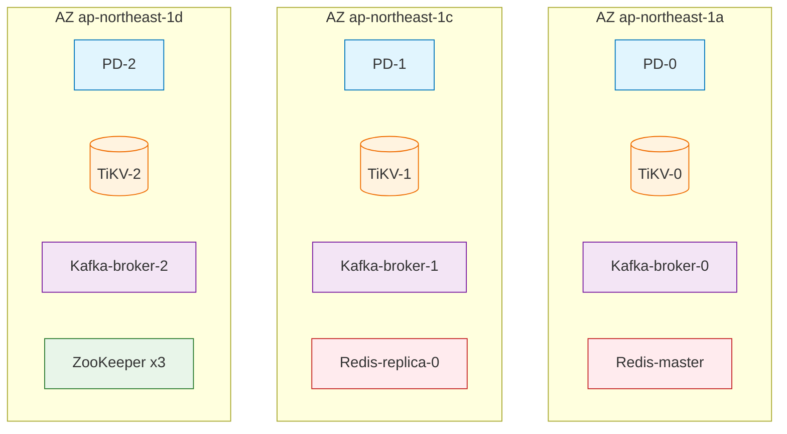
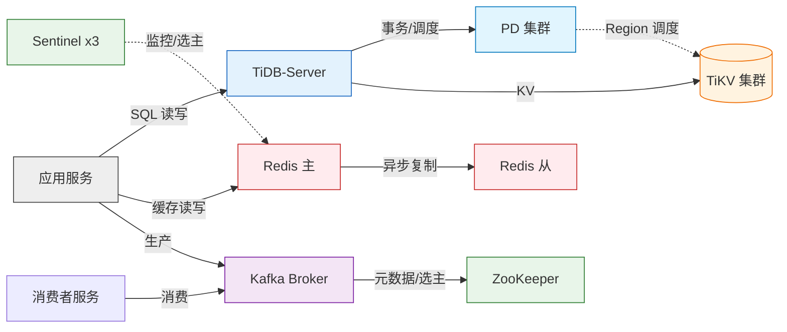

# 阶段二 · 拓扑建模指南（Topology Modeling）

> **目标**：从 evidence-bundle 归一化出组件清单 `inventory.json`，并生成 Mermaid 拓扑图（部署拓扑 + 数据流拓扑）。这是薄弱点分析的地基。

---

## Step 4.1 — 识别中间件实例

从 bundle 中按优先级识别每个自建中间件集群：

> **★★ 本客户的首要识别信号：EC2 Name tag。**
> 本客户按 **EC2 主机的 `Name` 标签**区分自建组件（如 `tikv-node-*`、`kafka-broker-*`、`redis-*`、`mysql-*`）。
> 识别时**先建立 K8s 节点 → EC2 Name tag 的映射**，再据此判断每个 Pod 属于哪个组件：
>
> ```
> pod (k8s/pods.json .spec.nodeName)
>   → node (cluster/nodes.json .metadata.name)
>     → providerID (node .spec.providerID = "aws:///<az>/i-xxxxxxxx")
>       → instanceId
>         → nameTag (aws/node-nametag-map.json 按 instanceId 匹配)   ★★ 组件归属线索
> ```
>
> ⚠️ **务必检查 `allTags`，不要只看 Name。** `node-nametag-map.json` / `collect-ec2.sh` 的 `ec2/instances.json` 都采集了实例的**全部标签**（`allTags`），常包含比 Name 更强的证据：云厂商自定义标签（如 `tidb-poc:role=tikv`、`tidb-poc:cluster=source`）、CloudFormation 元数据（`aws:cloudformation:stack-name`/`logical-id`）、Terraform 标签等。这些属于 **DECLARED 级证据**（部署声明），比仅靠 Name 字符串匹配的 **INFERRED_FROM_NAME 级证据**强得多，分析时应优先使用并在 `evidence` 字段写明引用的具体标签键。
>
> **但无论 Name tag 还是 allTags 里的标签，都只是"归属线索/部署声明"，不是"运行事实"。** 把 `nameTag`/标签写入 `inventory` 时必须遵守 [weakness-catalog_zh.md 的证据等级硬规则](weakness-catalog_zh.md#️-硬规则证据等级与禁止推测违反此节--分析失败必须重做)：
> - 可以写"该实例被标记/命名为 tikv 角色"（DECLARED 或 INFERRED_FROM_NAME，视证据来源）；
> - **不能写"这是一个 N 副本的 TiKV 集群"或"该组件跨 AZ 高可用"**，除非有主机层证据（进程、`pd-ctl`/`tiup` 输出等）证实这些机器确实组成同一逻辑集群并被应用/调度层感知。
> - 找不到某角色（如 PD）的 Name tag/标签时，**只能写"未观测到该角色的证据"**，不能写"不存在"或直接判定为单点风险——两者都是无证据的过度引申，必须标 `UNKNOWN`。

1. **Operator CR 优先**（`components/*.json`）—— 最准确：
   - `tidb-tidbclusters.json` → 每个 TidbCluster = 一套 TiDB（含 PD/TiKV/TiDB/TiFlash 分层与副本数）。
   - `kafka-kafkas.json` → 每个 Kafka CR = 一个 Kafka 集群（`.spec.kafka.replicas`、`.spec.zookeeper.replicas` 或 KRaft nodepool）。
   - `redis-*.json` / `mysql-*.json` → 对应集群。
2. **裸 StatefulSet 回退**（`k8s/statefulsets.json`）—— 无 CR 时靠命名与 label 识别：

| 组件 | 常见 StatefulSet/label 特征 |
|------|---------------------------|
| MySQL | 名称含 `mysql`/`mariadb`/`percona`；label `app=mysql`；容器镜像 `mysql:`/`percona` |
| TiKV / PD | 名称含 `tikv`/`pd`；镜像 `pingcap/tikv`/`pingcap/pd` |
| Redis | 名称含 `redis`；镜像 `redis:`/`bitnami/redis`；哨兵含 `sentinel` |
| Kafka | 名称含 `kafka`；镜像 `kafka`/`cp-kafka`/`strimzi` |
| ZooKeeper | 名称含 `zookeeper`/`zk`；镜像 `zookeeper` |

3. **确定部署形态**（对分析至关重要，同组件形态差异极大）：
   - Redis：单点 / 主从 / **哨兵 Sentinel** / **Redis Cluster 分片**。判据：是否有 sentinel Pod、CR mode 字段、`cluster-enabled`。
   - MySQL：单实例 / 主从异步 / 半同步 / **MGR(组复制)** / PXC。判据：CR 类型、`server_id`、`group_replication` 配置、副本数。
   - Kafka：ZooKeeper 模式 vs **KRaft** 模式。判据：是否存在 zookeeper StatefulSet / nodepool controller role。

## Step 4.2 — 构建 Pod → 节点 → AZ 映射

这是**所有可用区级韧性判断的核心**。对每个中间件的每个 Pod：

```
pod (k8s/pods.json .spec.nodeName)
  → node (cluster/nodes.json .metadata.name)
    → AZ  (node .metadata.labels["topology.kubernetes.io/zone"])
    → instance-type (node .metadata.labels["node.kubernetes.io/instance-type"])
```

对存储：

```
pod → volume(pvc) (pods .spec.volumes[].persistentVolumeClaim)
  → pvc (k8s/persistentvolumeclaims.json)
    → pv (cluster/persistentvolumes.json)
      → EBS volume + AZ (aws/ebs-volumes.json，或 pv.spec.nodeAffinity 的 zone)
      → storageClass (cluster/storageclasses.json：volumeBindingMode / allowedTopologies)
```

> **关键交叉校验**：副本 Pod 数达标，但若全部 `nodeName` 落在同一 AZ，则是**假高可用**。逐组件统计"每 AZ 的角色副本数"。

## Step 4.3 — 输出 inventory.json

归一化为统一结构，供后续检查与报告消费：

```json
{
  "cluster": "prod-eks",
  "region": "ap-northeast-1",
  "azs": ["ap-northeast-1a", "ap-northeast-1c", "ap-northeast-1d"],
  "nodes": [
    {"name": "ip-10-0-1-11", "instanceId": "i-0abc123", "nameTag": "tikv-node-az1", "az": "ap-northeast-1a", "instanceType": "r6i.2xlarge", "nodegroup": "data"}
  ],
  "components": [
    {
      "id": "tidb-main",
      "type": "tidb",
      "deploymentForm": "operator/tidb-operator",
      "namespace": "database",
      "source": "components/tidb-tidbclusters.json",
      "roles": [
        {"role": "pd",   "replicas": 3, "azSpread": {"1a":1,"1c":1,"1d":1}, "storageClass": "ebs-gp3", "antiAffinity": "required"},
        {"role": "tikv", "replicas": 3, "azSpread": {"1a":1,"1c":1,"1d":1}, "storageClass": "ebs-gp3", "antiAffinity": "preferred", "maxReplicas": 3, "locationLabels": ["zone","host"]},
        {"role": "tidb", "replicas": 2, "azSpread": {"1a":1,"1c":1},        "stateless": true}
      ],
      "services": [{"name": "tidb-main-tidb", "type": "ClusterIP"}],
      "backup": {"configured": true, "source": "components/tidb-backups.json"},
      "monitoring": {"serviceMonitor": true}
    },
    {
      "id": "kafka-events",
      "type": "kafka",
      "deploymentForm": "operator/strimzi",
      "roles": [
        {"role": "broker", "replicas": 3, "azSpread": {"1a":1,"1c":1,"1d":1}, "rackAware": true},
        {"role": "zookeeper", "replicas": 3, "azSpread": {"1a":1,"1c":1,"1d":1}}
      ],
      "config": {"default.replication.factor": 3, "min.insync.replicas": 2},
      "topics": [{"name": "orders", "rf": 3, "minIsr": 2, "partitions": 12}]
    }
  ],
  "collectionGaps": ["ebs-volumes (aws layer skipped)"]
}
```

> 无法从 bundle 得到的字段填 `null` 并加入 `collectionGaps`，**不要编造**。

---

## Step 4.4 — 生成 Mermaid 拓扑图

### 图 1：部署拓扑（AZ / 节点 / 角色 / 存储）

按 AZ 分组，展示每个中间件的角色副本落点。示例：



**约定**：
- 每个 AZ 一个 `subgraph`，Pod 放进所属 AZ —— 一眼看出 AZ 分布是否均衡。
- 用 `classDef` 给不同组件上色；数据库/存储用 `[(...)]` 圆柱形。
- 副本较多时可折叠为 "TiKV x3" 并在标签注明每 AZ 数量。
- 若某组件副本**全在一个 AZ**，在该节点标注 ⚠️ 并在图注里点名（这是 SPOF 预警）。

### 图 2：依赖 / 数据流拓扑

展示组件间调用与复制关系（读写路径、复制流、协调依赖）。示例：



**约定**：
- 实线 = 同步/数据请求路径；虚线 `-.->` = 控制面/复制/协调。
- 标注复制方式（同步/异步/Raft）——这直接关系到"AZ 挂了是否丢数据"。
- 标出**单向依赖**（如 Kafka 依赖 ZooKeeper；TiDB 依赖 PD）——上游挂则下游不可用。

### 图 3（可选）：AZ 故障爆炸半径示意

对每个 AZ 画一张"假设该 AZ 失效后各组件状态"的示意，或在报告用表格表达（见 risk-scoring）。

---

## 建模检查清单（进入 Step 5 前自检）

- [ ] 每个中间件都识别出了部署形态，**且标注了该形态判断的证据等级**（不是笼统写 "Redis 哨兵 3 节点主从"当作确定事实，除非有 CONFIRMED/DECLARED 证据支撑；否则写"标签/命名提示可能是 Redis，形态未验证"）。
- [ ] 已建立 Pod/实例 → **EC2 Name tag + allTags** 映射；Name tag 单独存在时按 `INFERRED_FROM_NAME` 处理，`allTags` 中的云标签/CFN 元数据按 `DECLARED` 处理，两者都**不能**当作 `CONFIRMED` 的组件角色/副本关系。
- [ ] 每个角色的 `replicas` 和 `azSpread` 都标注了证据等级（EC2/Pod 数量与物理 AZ 属于 CONFIRMED；但"这些实例构成一个逻辑集群/副本关系"若无主机层证据则是 UNKNOWN，不能把前者的确定性套到后者上）。
- [ ] 存储链路完整：Pod→PVC→PV→(EBS AZ)→StorageClass（此链路多为 CONFIRMED，可放心使用）。
- [ ] 两张 Mermaid 图都能渲染（括号/引号配对，classDef 正确），且图中**用视觉样式区分了 CONFIRMED / DECLARED / UNKNOWN**，未把未验证的组件关系画成确定的连线。
- [ ] 所有 bundle 缺失项、以及"找不到某角色实例"的情况，记入 `inventory.collectionGaps` 并标 `UNKNOWN`；**未编造任何数据，未把"未观测到"写成"不存在"**。
